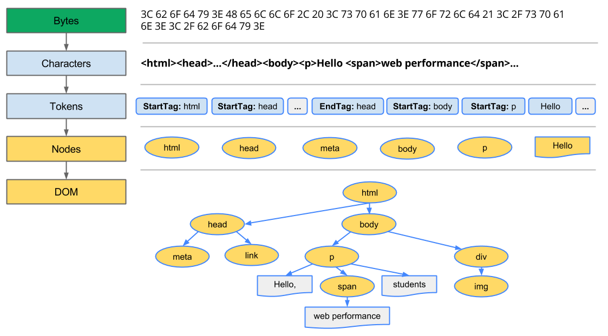

## 38장 브라우저의 렌더링 과정
- 웹 어플리케이션의 클라이언트 자바스크립트는 브라우저에서 HTML, CSS와 함께 실행된다.
- 브라우저는 HTML, CSS, 자바스크립트를 해석하고 렌더링 엔진을 통해 화면에 표시한다.
    - 파싱: HTML, CSS, 자바스크립트 코드를 해석하여 브라우저가 이해할 수 있는 구조로 변환하는 과정
    - 렌더링: HTML, CSS, 자바스크립트로 작성된 문서를 파싱하여 화면에 표시하는 과정
- 브라우저의 렌더링 과정은 다음과 같다.
1. 브라우저는 HTML, CSS, 자바스크립트, 이미지, 폰트 파일 등 렌더링에 필요한 리소스를 서버로부터 요청하고 응답을 받는다.
2. 브라우저의 렌더링 엔진은 서버로부터 응답된 HTML, CSS를 파싱하여 DOM, CSSOM을 생성하고 이들을 결합하여 렌더 트리를 생성한다.
3. 브라우저의 자바스크립트 엔진은 서버로부터 응답된 자바스크립트를 파싱하여 AST를 생성하고 바이트코드로 변환하여 실행한다. 이때 자바스크립트는 DOM API를 통해 DOM이나 CSSOM을 변경할 수 있다. 변경된 DOM, CSSOM은 렌더 트리로 결합된다.
4. 렌더 트리를 기반으로 브라우저의 렌더링 엔진은 화면에 표시할 내용을 계산하고 레이아웃을 수행하여 화면에 표시한다.

### 38.1 요청과 응답
- 브라우저의 핵심 기능은 필요한 리소스를 서버에 요청하고 응답 받아 브라우저에 시각적으로 렌더링하는 것이다.
- 서버에 요청을 전송하기 위해 브라우저는 주소창을 제공한다.
- 브라우저의 주소창에 URL을 입력하고 엔터를 누르면 URL의 호스트 이름이 DNS를 통해 IP 주소로 변환되고 해당 IP 주소로 HTTP 요청이 전송된다.
- 브라우저의 렌더링 엔진은 HTML을 파싱하는 도중에 외부 리소스를 로드하는 태그, 즉 css 파일을 로드하는 link 태그, 이미지 파일을 로드하는 Img 태그, script 태그 등을 만나면 HTML 파싱을 일시 중단하고 해당 리소스를 서버로부터 요청한다.

### 38.2 HTTP 1.1과 HTTP 2.0
- HTTP는 웹에서 브라우저와 서버가 통신하기 위한 프로토콜이다.
- HTTP/1.1은 기본적으로 커넥션 당 하나의 요청과 응답만 처리한다. 따라서 리소스의 동시 전송이 불가능한 구조이므로 요청할 리소스의 개수에 비례하여 응답 시간도 증가하는 단점이 있다.
- HTTP/2.0은 다중화 기능을 제공하여 하나의 TCP 커넥션으로 여러 요청과 응답을 주고받을 수 있다. 따라서 리소스의 동시 전송이 가능하므로 요청할 리소스의 개수에 비례하여 응답 시간이 증가하는 문제를 해결할 수 있다.

### 38.3 HTML 파싱과 DOM 생성
- HTML 문서를 브라우저에 시각적인 픽셀로 렌더링하려면 브라우저가 이해할 수 있는 자료구조로 변환하여 메모리에 저장해야 한다.

- 브라우저의 렌더링 엔진은 다음 그림과 같은 과정을 통해 응답받은 HTML 문서를 파싱하여 브라우저가 이해할 수 있는 자료구조인 DOM을 생성한다.

1. 서버에 존재하던 HTML 파일이 브라우저의 요청에 의해 응답된다. 이때 서버는 브라우저가 요청한 HTML 파일을 읽어 들여 메모리에 저장한 다음 메모리에 저장된 바이트(2진수)를 인터넷을 경유하여 응답한다.
2. 브라우저는 서버가 응답한 HTML 문서를 바이트(2진수)로 전달받는다. 응답된 바이트 형태의 HTML 문서는 meta 태그의 charset 속성에 의해 지정된 인코딩 방식을 기준으로 문자열로 변환된다. 
3. 문자열로 변환된 HTML 문서를 읽어들여 문법적 의미를 갖는 코드의 최소 단위인 토큰들로 분해한다.
4. 각 토큰들을 객체로 변환하여 노드들을 생성한다. 토큰의 내용에 따라 문서 노드, 요소 노드, 속성 노드, 텍스트 노드, 주석 노드 등으로 변환된다.
5. HTML 문서는 HTML 요소들의 집합으로 이루어지며 HTML 요소는 중첩 관계를 갖는다. 이때 중첩 관계에 의해 부자 관계가 형성된다. 이러한 HTML 요소 간의 부자 관계를 반영하여 모든 노드들을 트리 자료구조로 구성한다. 이를 DOM(Document Object Model)이라 한다.

### 38.4 CSS 파싱과 CSSOM 생성
- 렌더링 엔진은 DOM을 생성해 나가다가 css를 로드하는 link 태그나 style 태그를 만나면 HTML 파싱을 일시 중단한다.
- 그리고 CSS 파일을 서버로부터 요청하여 응답받고 HTML과 동일한 파싱과정을 거치며 해석하여 CSSOM(CSS Object Model)을 생성한다.
- 이후 CSS 파싱을 완료하면 HTML 파싱을 재개한다.

### 38.5 렌더 트리 생성
- 렌더링 엔진은 DOM과 CSSOM을 결합하여 렌더 트리를 생성한다.
- 렌더 트리는 화면에 표시할 요소들을 담은 트리 자료구조이다. 따라서 브라우저 화면에 렌더링되지 않는 노드(ex meta, script 등)와 css에 의해 비표시(ex display:none)되는 노드는 렌더 트리에 포함되지 않는다.
- 이후 완성된 렌더 트리는 각 HTML 요소의 레이아웃(위치와 크기)을 계산하는 데 사용되며 브라우저 화면에 픽셀을 렌더링하는 페인팅 처리에 입력된다.
- 지금까지 살펴본 브라우저의 렌더링 과정은 반복되서 실행될 수 있다. 예를 들어 다음과 같은 경우 반복해서 레이아웃 계산과 페인팅이 재차 실행된다.
  - 자바스크립트에 의한 노드 추가 또는 제거
  - 브라우저 창의 리사이징에 의한 뷰포트 크기 변경
  - HTML 요소의 레이아웃(위치, 크기)에 변경을 발생시키는 width/height, margin, padding, border, display, position.top/right/bottom/left 등의 CSS 속성 변경

### 38.6 자바스크립트 파싱과 실행
- HTML 문서를 파싱한 결과물로서 생성된 DOM은 HTML 문서의 구조와 정보뿐만 아니라 HTML 요소와 스타일 등을 변경할 수 있는 프로그래밍 인터페이스로서 DOM API를 제공한다.
- 즉, 자바스크립트 코드에서 DOM API를 사용하면 이미 생성된 DOM을 동적으로 변경할 수 있다.
- CSS 파싱과 마찬가지로 렌더링 엔진은 DOM을 생성해나가다가 자바스크립트 코드를 로드하는 script 태그를 만나면 HTML 파싱을 일시 중단한다.
- 그리고 자바스크립트 파일을 서버에 요청하여 로드한 뒤 자바스크립트 엔진에 제어권을 넘긴다.
- 자바스크립트 파싱과 실행이 종료되면 다시 렌더링 엔진으로 제어권이 넘어가고 DOM 생성을 재개한다.
- 자바스크립트 엔진은 자바스크립트 코드를 파싱하여 CPU가 이해할 수 있는 저수준 언어로 변환하고 실행하는 역할을 한다.
- 자바스크립트 엔진은 자바스크립트 코드를 해석하여 AST(추상 구문 트리)를 생성한다. 그리고 AST를 기반으로 바이트코드로 변환하여 실행한다.

**토크나이징**
- 단순한 문자열인 자바스크립트 코드를 의미 있는 토큰으로 분해하는 과정

**파싱**
- 토큰들의 집합을 구문 분석하여 AST를 생성한다.
- AST는 토큰에 문법적 의미와 구조를 반영한 트리 구조의 자료구조다.
- AST는 인터프리터나 컴파일러만이 사용하는 것이 아니다. AST를 사용하면 typescript, babel, prettier 같은 트랜스파일러를 구현할 수도 있다.

**바이트코드 생성과 실행**
- 파싱의 결과물로서 생성된 AST는 인터프리터가 실행할 수 있는 중간 코드인 바이트코드로 변환되고 인터프리터에 의해 실행된다.
- 참고로 v8 엔진의 경우 자주 사용되는 코드는 터보팬이라고 불리는 컴파일러에 의해 최적화된 머신 코드로 컴파일되어 성능을 최적화한다.
- 만약 코드의 사용 빈도가 적어지면 다시 디옵티마이징하기도 한다.

### 38.7 리플로우와 리페인트
- 만약 자바스크립트 코드에 DOM이나 CSSOM을 변경하는 DOM API가 사용된 경우 DOM이나 CSSOM이 변경된다.
- 이때 변경된 DOM과 CSSOM은 다시 렌더 트리로 결합되고 변경된 렌더 트리를 기반으로 하여 레이아웃과 페인트 과정을 거쳐 브라우저의 화면에 다시 렌더링한다.
- 이를 리플로우(reflow)와 리페인트(repaint)라 한다.
- 리플로우는 렌더 트리의 레이아웃을 재계산하는 과정이다. 레이아웃은 각 요소의 위치와 크기를 계산하는 것을 말한다.
- 리페인트는 렌더 트리의 각 노드가 화면에 픽셀로 렌더링되는 과정이다. 레이아웃이 변경되면 리페인트도 발생한다.
- 레이아웃에 영향이 없는 변경은 리페인트만 발생한다. 예를 들어, 색상이나 글자 크기, 글자체 등의 변경은 리페인트만 발생한다.

### 38.8 자바스크립트 파싱에 의한 HTML 파싱 중단
- 브라우저는 동기적으로, 즉 위에서 아래 방향으로 순차적으로 HTML, CSS, 자바스크립트를 파싱하고 실행한다.
- 이것은 script 태그의 위치에 따라 HTML 파싱이 블로킹되어 DOM 생성이 지연될 수 있다는 것을 의미한다. 
- 또 DOM API를 사용하여 DOM을 변경하는 자바스크립트 코드가 실행되면 DOM이 완성되지 않은 상태에서 DOM을 조작하려는 시도가 발생할 수 있다.
- 이러한 이유로 script 태그의 위치를 body 태그의 가장 아래에 위치시키는 것이 권장된다. 이렇게 하면 DOM이 완성된 상태에서 자바스크립트 코드가 실행되므로 페이지 로딩 시간이 단축된다.

### 38.9 script 태그의 async/defer 어트리뷰트
- script 태그에 async 또는 defer 어트리뷰트를 사용하면 HTML 파싱이 블로킹되지 않는다.

**async 어트리뷰트**
- HTML 파싱과 외부 자바스크립트 파일의 로드가 비동기적으로 동시에 진행된다.
- 단, 자바스크립트의 파싱과 실행은 자바스크립트 파일의 로드가 완료된 직후 진행되며, 이때 HTML 파싱이 중단된다.
- 여러 개의 script 태그에 async 어트리뷰트를 지정하면 각 script 태그의 순서와는 상관없이 로드가 완료된 자바스크립트부터 먼저 실행되므로 순서가 보장되지 않는다.

**defer 어트리뷰트**
- async 어트리뷰트와 마찬가지로 HTML 파싱과 외부 자바스크립트 파일의 로드가 비동기적으로 동시에 진행된다.
- 단, 자바스크립트의 파싱과 실행은 HTML 파싱이 완료된 직후 진행된다.

## 39장 DOM
- DOM은 HTML 문서의 계층적 구조와 정보를 표현하며 이를 제어할 수 있는 API, 즉 프로퍼티와 메서드를 제공하는 트리 자료구조이다.

### 39.1 노드
#### 39.1.1 HTML 요소와 노드 객체
- HTML 요소는 HTML 문서를 구성하는 개별적인 요소를 의미한다.
- HTML 요소는 렌더링 엔진에 의해 파싱되어 DOM을 구성하는 요소 노드 객체로 변환된다.
- 이때 어트리뷰트는 어트리뷰트 노드로, HTML 요소의 텍스트 컨텐츠는 텍스트 노드로 변환된다.
  - 요소 노드 div - 어트리뷰트 노드 class="greeting"
  - 텍스트 노드 Hello

```html
<div class="greeting">Hello</div>
```

- 이때 HTML 요소 간에는 중첩 관계에 의해 계층적인 부자 관계가 형성된다. 

**트리 자료구조**
- 트리 자료구조는 노드들의 계층 구조로 이뤄진다.
- 부모 노드와 자식 노드로 구성되어 노드 간의 계층적 구조(부자, 형제 관계)를 표현하는 비선형 자료구조를 말한다.
- 노드 객체들로 구성된 트리 자료구조를 DOM이라 한다.

#### 39.1.2 노드 객체의 타입
- DOM은 노드 객체의 계층적인 구조로 구성된다. 노드 객체는 종류가 있고 상속 구조를 갖는다.

**문서 노드**
- 문서 노드는 DOM 트리의 최상위에 존재하는 루트 노드로서 document 객체를 가리킨다.
- document 객체는 브라우저가 렌더링한 HTML 문서 전체를 표현하는 객체로서 전역 객체 window의 프로퍼티이다.
- 브라우저 환경의 모든 자바스크립트 코드는 script 태그에 의해 분리되어 있어도 하나의 전역 객체 window를 공유한다.
- 따라서 script 태그에 의해 분리된 자바스크립트 코드끼리 전역 변수를 공유할 수 있다.

**요소 노드**
- 요소 노드는 HTML 요소를 가리키는 객체다.
- 요소 노드는 HTML 요소 간의 중첩에 의해 부자 관계를 가지며 문서의 구조를 표현한다고 할 수 있다.

**어트리뷰트 노드**
- 어트리뷰트 노드는 HTML 요소의 어트리뷰트를 가리키는 객체다.
- 어트리뷰트 노드는 부모 노드와 연결되어 있지 않기 때문에 어트리뷰트 노드에 접근하여 어트리뷰트를 참조하거나 변경하려면 먼저 요소 노드에 접근해야 한다.

**텍스트 노드**
- 텍스트 노드는 HTML 요소의 텍스트를 가리키는 객체다.
- 요소 노드가 문서의 구조를 표현한다면 텍스트 노드는 문서의 정보를 표현한다.
- 텍스트 노드는 요소 노드의 자식 노드이며, 자식 노드를 가질 수 없는 리프 노드다.

#### 39.1.3 노드 객체의 상속 구조
- DOM을 구성하는 노드 객체는 자신의 구조와 정보를 제어할 수 있는 DOM API를 사용할 수 있다.
- 이를 통해 노드 객체는 자신의 부모, 형제, 자식을 탐색할 수 있으며, 자신의 어트리뷰트와 텍스트를 조작할 수도 있다.
- DOM을 구성하는 노드 객체는 EMCAScript 표준에 정의된 객체가 아니라 브라우저 환경에 종속된 객체다.
- 노드 객체는 상속 구조를 갖는다. 즉, 노드 객체는 상위 객체인 Node 객체를 상속받는다.
- DOM은 HTML 문서의 계층적 구조와 정보를 표현하며 이를 제어할 수 있는 API, 즉 프로퍼티와 메서드를 제공하는 트리 자료구조다.

### 39.2 요소 노드 취득
- HTML의 구조나 내용 또는 스타일을 변경하려면 먼저 변경하고자 하는 요소 노드를 취득해야 한다.

#### 39.2.1 id를 이용한 요소 노드 취득
- Document.prototype.getElementById 메서드는 id 어트리뷰트 값으로 요소 노드를 취득한다.
- id 값은 HTML 문서 내에서 유일한 값이어야 하며, class 어트리뷰트와는 달리 공백으로 구분된 여러 개의 id 값을 가질 수 없다.
- 중복된 id 값을 갖는 요소가 여러개 존재할 수는 있지만 에러를 발생시키지 않고 첫번째 요소 노드만 반환한다.

#### 39.2.2 태그 이름을 이용한 요소 노드 취득
- Document.prototype.getElementsByTagName 메서드는 태그 이름으로 요소 노드를 취득한다.
- getElementsByTagName 메서드는 여러 개의 요소 노드 객체를 갖는 DOM 컬렉션 객체인 HTMLCollection 객체를 반환한다.
- HTMLCollection 객체는 유사 배열 객체이면서 이터러블이다.
- getElementsByTagName 메서드는 Document.prototype에 정의된 메서드와 Element.prototype에 정의된 메서드로 두 가지 버전이 있다.

#### 39.2.3 class를 이용한 요소 노드 취득
- Document.prototype.getElementsByClassName 메서드는 class 어트리뷰트 값으로 요소 노드를 취득한다.
- getElementsByClassName 메서드는 여러 개의 요소 노드 객체를 갖는 DOM 컬렉션 객체인 HTMLCollection 객체를 반환한다.
- getElementsByClassName 메서드도 Document.prototype에 정의된 메서드와 Element.prototype에 정의된 메서드로 두 가지 버전이 있다.

#### 39.2.6 HTMLCollection과 NodeList
- HTMLCollection과 NodeList의 중요한 특징은 노드 객체의 상태 변화를 실시간으로 반영하는 살아있는 객체라는 것이다.
- HTMLCollection은 실시간으로 노드 객체의 상태 변경을 반영하고 NodeList는 대부분의 경우 non-live 객체이지만 경우에 따라 live 객체가 될 수도 있다.

**HTMLCollection**
- HTMLCollection 객체는 실시간으로 노드 객체의 상태 변경을 반영하므로 반복문으로 순회하면서 변경할 때 주의가 필요하다.
- HTMLCollection 객체를 for문으로 순회할 때는 역방향으로 순회하거나 while문을 사용하는 것이 좋다.
- HTMLCollection 객체를 배열로 변환하여 순회할 수도 있다.

**NodeList**
- HTMLCollection 객체와 달리 NodeList 객체는 대부분의 경우 non-live 객체이다. getElementsByTagName 대신 querySelectorAll 메서드를 사용하면 NodeList 객체를 반환한다.
- 하지만 childNodes 프로퍼티가 반환하는 NodeList 객체는 live 객체이다.
- HTMLCollection 객체와 NodeList 객체 모두 예상과 다르게 동작할 수 있으므로 객체를 배열로 변환하여 사용하는 것이 좋다.

### 39.3 노드 탐색
- 요소 노드를 취득한 다음 요소 노드의 부모, 형제, 자식 노드를 탐색할 수 있다.

#### 39.3.1 공백 텍스트 노드
- HTML 요소 사이의 스페이스, 탭, 줄바꿈 등의 공백 문자는 텍스트 노드를 생성한다.

#### 39.3.2 자식 노드 탐색
- 자식 노드를 탐색하기 위해서는 다음과 같은 노드 탐색 프로퍼티를 사용한다.

| 프로퍼티 | 설명                                                                  |
| --- |---------------------------------------------------------------------|
| Node.prototype.childNodes | 자식 노드를 모두 탐색하여 NodeList에 담아 반환한다. 요소 노드 뿐만 아니라 텍스트 노드도 포함되어 있을 수 있다 |
| Element.prototype.children | 자식 요소 노드만을 탐색하여 HTMLCollection에 담아 반환한다. 텍스트 노드는 제외된다. |
| Node.prototype.firstChild | 첫 번째 자식 노드를 반환한다. 텍스트 노드일 수도 있고 요소 노드일 수도 있다. |
| Node.prototype.lastChild | 마지막 자식 노드를 반환한다. 텍스트 노드일 수도 있고 요소 노드일 수도 있다. |
| Element.prototype.firstElementChild | 첫 번째 자식 요소 노드를 반환한다. 텍스트 노드는 제외된다. |
| Element.prototype.lastElementChild | 마지막 자식 요소 노드를 반환한다. 텍스트 노드는 제외된다. |

#### 39.3.3 자식 노드 존재 확인
- 자식 노드가 존재하는지 확인하기 위해 다음과 같은 프로퍼티를 사용한다.
- Node.prototype.hasChildNodes 메서드는 자식 노드가 존재하면 true, 그렇지 않으면 false를 반환한다.
- 텍스트 노드가 아닌 요소 노드가 존재하는지 확인하려면 Element.prototype.childElementCount 프로퍼티를 사용한다.

#### 39.3.4 요소 노드의 텍스트 노드 탐색
- 요소 노드의 텍스트 노드는 요소 노드의 자식 노드다.
- 따라서 요소 노드의 텍스트 노드는 firstChild, lastChild 프로퍼티로 탐색할 수 있다.

#### 39.3.5 부모 노드 탐색
- 부모 노드를 탐색하기 위해 Node.prototype.parentNode 프로퍼티를 사용한다.

#### 39.3.6 형제 노드 탐색
- 형제 노드를 탐색하기 위해 다음과 같은 프로퍼티를 사용한다.
- 어트리뷰트 노드는 요소 노드와 연결되어 있지만 부모 노드가 같은 형제 노드가 아니기 때문에 반환되지 않는다.

| 프로퍼티 | 설명                                                                  |
| --- |---------------------------------------------------------------------|
| Node.prototype.previousSibling | 이전 형제 노드를 반환한다. 텍스트 노드일 수도 있고 요소 노드일 수도 있다. |
| Node.prototype.nextSibling | 다음 형제 노드를 반환한다. 텍스트 노드일 수도 있고 요소 노드일 수도 있다. |
| Element.prototype.previousElementSibling | 이전 형제 요소 노드를 반환한다. 텍스트 노드는 제외된다. |
| Element.prototype.nextElementSibling | 다음 형제 요소 노드를 반환한다. 텍스트 노드는 제외된다. |

### 39.4 노드 정보 취득
- 노드 객체의 정보를 취득하기 위해 다음과 같은 프로퍼티를 사용한다.

| 프로퍼티 | 설명                                                               |
| --- |------------------------------------------------------------------|
| Node.prototype.nodeName | 노드의 이름을 반환한다. 요소 노드의 경우는 대문자로 반환된다.                              |
| Node.prototype.nodeType | 노드의 타입을 반환한다. 요소 노드는 1,  텍스트 노드는 3이다. 문서 노드 타입은 9이다. |

### 39.5 요소 노드의 텍스트 조작
#### 39.5.1 nodeValue
- Node.prototype.nodeValue 프로퍼티는 setter와 getter 모두 존재하는 접근자 프로퍼티다.
- nodeValue 프로퍼티는 텍스트 노드의 경우 텍스트 노드의 값, 요소 노드의 경우 null을 반환한다.
- nodeValue 프로퍼티는 읽기 전용이 아니므로 값을 변경할 수 있다.
  - 텍스트를 변경할 요소 노드를 취득한 다음, firstChild 프로퍼티를 사용하여 텍스트 노드를 탐색한다.
  - 텍스트 노드의 nodeValue 프로퍼티에 새로운 텍스트를 할당한다.

#### 39.5.2 textContent
- Node.prototype.textContent 프로퍼티는 setter와 getter 모두 존재하는 접근자 프로퍼티다.
- 요소 노드의 textContent 프로퍼티를 참조하면 요소 노드의 콘텐츠 영역 내의 텍스트를 모두 반환한다.

### 39.6 DOM 조작
#### 39.6.1 innerHTML
- Element.prototype.innerHTML 프로퍼티는 setter와 getter 모두 존재하는 접근자 프로퍼티다.
- 앞서 살펴본 textContent 프로퍼티는 HTML 마크업을 무시하고 텍스트만을 다루지만 innerHTML 프로퍼티는 HTML 마크업을 포함한 문자열을 다룬다.
- 요소 노드의 innerHTML에 문자열을 할당하면 요소 노드의 모든 자식 노드가 제거되고 할당한 문자열에 포함되어 있는 HTML 마크업이 파싱되어 새로운 자식 노드로 대체된다.
- 이때 사용자로부터 입력받은 데이터를 innerHTML 프로퍼티에 할당하면 크로스 사이트 스크립팅(XSS) 공격에 취약해질 수 있으므로 주의해야 한다.
- HTML5는 innerHTML 프로퍼티를 사용하여 HTML 마크업을 삽입할 때 스크립트를 실행하지 않도록 보안을 강화했다.
- innerHTML 프로퍼티의 또 다른 잔점은 HTML 마크업을 파싱하고 DOM을 재생성하는 과정이 비용이 많이 든다는 것이다.
- innerHTML 프로퍼티는 복잡하지 않은 요소를 새롭게 추가할 때 유용하지만 기존 요소를 제거하지 않으면서 위치를 지정해 추가하거나 요소를 변경할 때는 innerHTML 프로퍼티를 사용하지 않는 것이 좋다.

#### 39.6.2 insertAdjacentHTML
- Element.prototype.insertAdjacentHTML 메서드는 기존 요소를 제거하지 않으면서 위치를 지정해 추가하거나 요소를 변경할 수 있다.
- insertAdjacentHTML 메서드는 첫 번째 인수로 삽입 위치를 지정하는 위치값을, 두 번째 인수로 삽입할 HTML 문자열을 전달받는다.
- insertAdjacentHTML 메서드는 HTML 마크업을 파싱하고 DOM을 재생성하는 innerHTML 프로퍼티와 달리 기존 요소를 제거하지 않으면서 위치를 지정해 추가하거나 요소를 변경할 수 있다.

#### 39.6.3 노드 생성과 추가
- DOM은 노드를 직접 생성/삽입/삭제/치환하는 메서드도 제공한다.

**노드 생성**
- Document.prototype.createElement(tagName) 메서드는 요소 노드를 생성한다.

**텍스트 노드 생성**
- Document.prototype.createTextNode(data) 메서드는 텍스트 노드를 생성한다.

**테스트 노드를 요소 노드의 자식 노드로 추가**
- Node.prototype.appendChild(childNode) 메서드는 특정 부모 노드의 자식 노드 리스트의 맨 마지막에 새로운 자식 노드를 추가한다.

**요소 노드를 DOM에 추가**
- Node.prototype.appendChild 메서드는 특정 부모 노드의 자식 노드 리스트의 맨 마지막에 새로운 자식 노드를 추가한다.

#### 39.6.4 복수의 노드 생성과 추가
- 리플로우와 리페인트가 여러번 실행되는 것을 방지하기 위해 div 컨테이너 같은 곳에 노드를 추가한 후 DOM에 추가하는 방법이 있다.
- 하지만 불필요한 div 태그를 추가하지 않기 위해 DocumentFragment 객체를 사용할 수 있다.

#### 39.6.5 노드 삽입
**마지막 노드로 추가**
- Node.prototype.appendChild 메서드는 특정 부모 노드의 자식 노드 리스트의 맨 마지막에 새로운 자식 노드를 추가한다.

**지정한 위치에 삽입**
- Node.prototype.insertBefore(newNode, referenceNode) 메서드는 특정 부모 노드의 자식 노드 리스트의 특정 자식 노드 앞에 새로운 자식 노드를 삽입한다.

### 39.7 어트리뷰트
#### 39.7.1 어트리뷰트 노드와 attributes 프로퍼티
- 어트리뷰트는 HTML 요소의 부가 정보를 제공한다.
- 어트리뷰트는 HTML 요소의 시작 태그에 포함되어 있으며 어트리뷰트의 이름과 값은 =로 연결되어 있다.
- 어트리뷰트는 요소 노드의 어트리뷰트 노드로 변환되어 DOM을 구성한다.
- 요소 노드의 모든 어트리뷰트 노드는 요소 노드의 Element.prototype.attributes 프로퍼티로 접근할 수 있다.
- attributes 프로퍼티는 getter만 존재하는 읽기 전용 접근자 프로퍼티이며, NamedNodeMap 객체를 반환한다.

#### 39.7.2 HTML 어트리뷰트 조작
- attributes 프로퍼티는 읽기 전용 접근자 프로퍼티에 값을 취득하는 과정이 다소 번거롭다.
- Element.prototype.getAttribute/setAttribute 메서드를 사용하면 편리하게 어트리뷰트 값을 취득하거나 변경할 수 있다.

#### 39.7.3 HTML 어트리뷰트 vs DOM 프로퍼티
- 요소 노드 객체에는 HTML 어트리뷰트에 대응하는 프로퍼티가 존재한다. 이 DOM 프로퍼티들은 HTML 어트리뷰트 값을 초기값으로 가지고 있다.
- DOM 프로퍼티는 setter와 getter 모두 존재하는 접근자 프로퍼티다. 따라서 DOM 프로퍼티를 사용하면 HTML 어트리뷰트를 조작하는 것과 같은 효과를 얻을 수 있다.
- HTML 어트리뷰트는 DOM에서 중복 관리되고 있는 것처럼 보이지만 그렇지 않다.
- HTML 어트리뷰트의 역할은 HTML 요소의 초기 상태를 지정하는 것이다. 즉, HTML 어트리뷰트 값은 HTML 요소의 초기 상태를 의미하며 이는 변하지 않는다.
- 요소 노드의 초기 상태는 어트리뷰트 노드가 관리하며, 요소 노드의 최신 상태는 DOM 프로퍼티가 관리한다.

**DOM 프로퍼티 값의 타입**
- getAttribute 메서드로 취득한 어트리뷰트 값은 언제나 문자열이다. 하지만 DOM 프로퍼티로 취득한 최신 상태 값은 문자열이 아닐 수도 있다.

#### 39.7.4 data 어트리뷰트와 dataset 프로퍼티
- data 어트리뷰트와 dataset 프로퍼티를 사용하면 HTML 요소에 정의한 사용자 정의 어트리뷰트와 자바스크립트 간에 데이터를 교환할 수 있다.
- data 어트리뷰트의 값은 HTMLElement.dataset 프로퍼티로 취득할 수 있다.
- dataset 프로퍼티는 data- 접두사를 제외한 어트리뷰트 이름을 카멜 케이스로 변환한 이름을 프로퍼티 이름으로 갖는 DOMStringMap 객체를 반환한다.

### 39.8 스타일
#### 39.8.1 인라인 스타일 조작
- HTMLElement.prototype.style 프로퍼티는 setter와 getter 모두 존재하는 접근자 프로퍼티로서 요소 노드의 인라인 스타일을 취득하거나 추가 또는 변경한다.

#### 39.8.2 클래스 조작
- .으로 시작하는 클래스 선택자를 사용하여 CSS class를 미리 정의한 다음, HTML 요소의 class 어트리뷰트 값을 변경하여 HTML 요소의 스타일을 변경할 수도 있다.

#### 39.8.3 요소에 적용되어 있는 CSS 스타일 참조
- getComputedStyle 메서드는 인라인 뿐만 아니라 지정한 요소에 적용된 모든 CSS 스타일을 가져온다.

### 39.9 DOM 표준
- HTML과 DOM 표준은 W3C와 WHATWG에 의해 관리되고 있다.

### 느낀점
발표를 듣지 못해서 아쉬웠지만 결님이 중간중간 넣어주신 링크들 덕분에 깊이 있는 이해를 할 수 있었던 것 같아 감사했습니다. 내용이 너무 좋았습니다!
브라우저의 렌더링 과정은 간단하게만 안채로 외우고 다녔던 것 같은데 자세히 다뤄본 게 처음이라 생각보다 더 재미있었습니다.