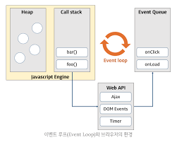

## 42장 비동기 프로그래밍
### 42.1 동기 처리와 비동기 처리
- 자바스크립트 엔진은 단 하나의 실행 컨텍스트 스택을 가지며 동시에 2개 이상의 함수를 실행할 수 없음
- 이처럼 자바스크립트 엔진은 한 번에 하나의 태스크만 실행할 수 있는 싱글 스레드 방식으로 동작
  - 처리에 시간이 걸리는 태스크를 실행하는 경우 블로킹이 발생 

- 아래 예제의 sleep 함수는 3초 후에 foo 함수를 호출. 이때 bar 함수는 sleep 함수의 실행이 종료된 이후에 호출되므로 3초 이상 호출되지 못하고 블로킹 된다.
- 이처럼 현재 실행 중인 태스크가 종료할 때까지 다음에 실행될 태스크가 대기하는 방식을 **동기 처리**라고 함

```javascript
function sleep(func, delay) {
    const delayUntil = Date.now() + delay;
    while(Date.now() < delayUntil);
    func();
}

function foo(){
    console.log('foo');
}

function bar(){
    console.log('bar');
}

sleep(foo, 3 * 1000);
bar();
```

- 위 예제를 타이머 함수인 setTimeout을 사용하여 비동기 처리 방식으로 수정
- setTimeout 함수 이후의 태스크를 블로킹하지 않고 곧바로 실행

```javascript
function foo() {
    console.log('foo');
}

function bar() {
    console.log('bar');
}

setTimeout(foo, 3*1000);
bar();
```

- 동기 처리 방식
  - 장점: 실행 순서가 보장
  - 단점: 앞선 태스크가 종료할 때까지 이후 태스크들이 블로킹 됨
- 비동기 처리 방식
  - 장점: 블로킹이 발생하지 않음
  - 단점: 실행 순서가 보장되지 않음

- 비동기 처리 방식으로 동작하는 함수: 타이머 함수(setTimeout, setInterval), HTTP 요청, 이벤트 핸들러(커스텀 이벤트, click, blur, focus 제외)

### 42.2 이벤트 루프와 태스크 큐
- 브라우저가 동작할 때 HTML 요소가 애니메이션 효과를 통해 움직이며 이벤트를 처리하기도 하고 HTTP 요청을 통해 서버로부터 데이터를 가지고 오면서 렌더링하기도 한다.
- 이처럼 자바스크립트의 동시성을 지원하는 것이 바로 이벤트 루프다. 이벤트 루프는 브라우저에 내장되어 있는 기능 중 하나다.


- 자바스크립트 엔진은 크게 2개의 영역으로 구분할 수 있다.
  - 콜스택: 실행 컨텍스트 스택이라고도 하며, 소스코드 평가 과정에서 생성된 실행 컨텍스트가 추가/제거되는 스택 자료구조 
  - 힙: 객체가 저장되는 메모리 공간으로 실행 컨텍스트는 힙에 저장된 객체를 참조한다.

- 비동기 처리에서 소스코드의 평가와 실행을 제외한 모든 처리는 자바스크립트 엔진을 구동하는 환경인 브라우저 또는 Node.js가 담당한다.
- 예를 들어, 비동기 방식으로 동작하는 setTimeout의 콜백 함수의 평가와 실행은 자바스크립트 엔진이 담당하지만 호출 스케줄링을 위한 타이머 설정과 콜백 함수의 등록은 브라우저 또는 Node.js가 담당한다.
- 이를 위해 브라우저 환경은 태스크 큐와 이벤트 루프를 제공
  - 태스크 큐: 비동기 함수의 콜백 함수 또는 이벤트 핸들러가 일시적으로 보관되는 영역
  - 이벤트 루프: 콜 스택에 현재 실행 중인 실행 컨텍스트가 있는지, 그리고 태스크 큐에 대기 중인 함수가 있는지 반복적으로 확인하며 콜 스택이 비어있으면 태스크 큐에서 함수를 꺼내 콜 스택으로 이동시킴
  
- (브라우저의 비동기 동작 방식)[https://velog.io/@sugyinbrs/Event-Loop-Call-Stack-%EC%9D%B4-%EC%9E%91%EB%8F%99%ED%95%98%EB%8A%94-%EB%B2%95]

## 43장 Ajax
### 43.1 Ajax란?
- Ajax란 자바스크립트를 사용하여 브라우저가 서버에게 비동기 방식으로 데이터를 요청하고, 서버가 응답한 데이터를 수신하여 웹페이지를 동적으로 갱신하는 프로그래밍 방식을 말한다.
- Ajax는 브라우저에서 제공하는 Web API인 XMLHttpRequest 객체를 기반으로 동작한다.
- 이전의 웹페이지는 완전한 HTML을 전송받아 웹페이지 전체를 처음부터 다시 렌더링하는 방식으로 동작했다. 이 방식은 다음과 같은 단점이 있다.
  - 변경할 필요가 없는 부분까지 포함된 완전한 HTML을 매번 다시 전송받아 불필요한 데이터 통신이 발생
  - 언제나 다시 렌더링하므로 화면 전환이 일어나면 화면이 순간적으로 깜빡이는 현상이 발생
  - 클라이언트와 서버와의 통신이 동기 방식으로 동작하므로 서버로부터 응답을 받을 때까지 브라우저가 블로킹되어 사용자 경험이 저하
- Ajax는 이러한 단점을 극복하기 위해 서버로부터 필요한 데이터만 전송받아 변경이 필요한 부분만 동적으로 갱신하는 방식으로 동작한다. Ajax는 다음과 같은 장점이 있다.
  - 변경할 부분을 갱신하는 데 필요한 데이터만 서버로부터 전송받아 불필요한 데이터 통신을 최소화
  - 변경할 필요가 없는 부분은 다시 렌더링하지 않아 화면이 깜빡이지 않음
  - 비동기 방식으로 동작하므로 서버로부터 응답을 기다리는 동안 브라우저가 블로킹되지 않아 사용자 경험이 향상

### 43.2 JSON
- Ajax는 서버로부터 전송받은 데이터를 자바스크립트 객체로 변환하여 사용해야 한다. 이때 사용되는 데이터 형식이 JSON이다.
- JSON은 클라이언트와 서버 간의 HTTP 통신을 위한 텍스트 데이터 포맷이다. 자바스크립트에 종속되지 않는 언어 독립형 데이터 포맷으로, 대부분의 프로그래밍 언어에서 사용할 수 있다.

#### 43.2.1 JSON 표기 방식
- JSON은 자바스크립트의 객체 리터럴과 유사하게 키와 값으로 구성된 순수한 텍스트다.
- JSON의 키는 반드시 큰따옴표로 묶어야 한다.
```json
{
    "name": "Lee",
    "age": 20,
    "alive": true,
    "hobby": ["traveling", "tennis"]
}
```

#### 43.2.2 JSON.stringify
- JSON.stringify 메서드는 자바스크립트 객체를 JSON 문자열로 변환한다.
- 클라이언트가 서버로 객체를 전송하려면 객체를 문자열화해야 하는데 이를 직렬화라 한다.
```javascript
const obj = {
    name: 'Lee',
    age: 20,
    alive: true,
    hobby: ['traveling', 'tennis']
};

const json = JSON.stringify(obj);
console.log(json); // {"name":"Lee","age":20,"alive":true,"hobby":["traveling","tennis"]}

// 객체를 JSON 포맷의 문자열로 변환하면서 들여쓰기 한다.
const prettyJson = JSON.stringify(obj, null, 2);
console.log(prettyJson);
/*
{
  "name": "Lee",
  "age": 20,
  "alive": true,
  "hobby": [
    "traveling",
    "tennis"
  ]
}
*/

// replacer 함수. 값의 타입이 Number이면 필터링되어 반환되지 않는다.
function filter(key, value){
    return typeof value === 'number' ? undefined : value;
}

// JSON.stringify 메서드에 두 번째 인수로 replacer 함수를 전달한다.
const filteredJson = JSON.stringify(obj, filter, 2);
console.log(filteredJson);
/*
{
  "name": "Lee",
  "alive": true,
  "hobby": [
    "traveling",
    "tennis"
  ]
}
*/

// JSON.stringify 메서드는 객체뿐만 아니라 배열도 JSON 문자열로 변환할 수 있다.
const todos = [
    { id: 1, content: 'HTML', completed: true },
    { id: 2, content: 'CSS', completed: false },
    { id: 3, content: 'JS', completed: false }
];

const todosJson = JSON.stringify(todos, null, 2);
console.log(todosJson);
/*
string [
    {
        "id": 1,
        "content": "HTML",
        "completed": true
    },
    {
        "id: 2,
        "content": "CSS",
        "completed": false
    },
    {
        "id": 3,
        "content": "JS",
        "completed": false
    } 
]
*/
```

#### 43.2.3 JSON.parse
- JSON.parse 메서드는 JSON 문자열을 자바스크립트 객체로 변환한다.
- 클라이언트가 서버로부터 전송받은 JSON 문자열을 객체로 변환하는 것을 역직렬화라 한다.
```javascript
const todos = [
    { id: 1, content: 'HTML', completed: true },
    { id: 2, content: 'CSS', completed: false },
    { id: 3, content: 'JS', completed: false }
];

const todosJson = JSON.stringify(todos);

// JSON.parse 메서드는 JSON 문자열을 자바스크립트 객체로 변환한다.
const parsedTodos = JSON.parse(todosJson);
console.log(parsedTodos);
/*
[
    { id: 1, content: 'HTML', completed: true },
    { id: 2, content: 'CSS', completed: false },
    { id: 3, content: 'JS', completed: false }
]
*/
```

### 43.3 XMLHttpRequest
- 자바스크립트를 사용하여 HTTP 요청을 전송하려면 XMLHttpRequest 객체를 사용한다.
- Web API인 XMLHttpRequest 객체는 HTTP 요청 전송과 응답 수신을 위한 다양한 메서드와 프로퍼티를 제공한다.

#### 43.3.1 XMLHttpRequest 객체 생성
- XMLHttpRequest 객체는 XMLHttpRequest 생성자 함수를 통해 생성한다.
- XMLHttpRequest 객체는 브라우저에서 제공하는 Web API이므로 브라우저 환경에서만 동작한다.
```javascript
const xhr = new XMLHttpRequest();
```

#### 43.3.2 XMLHttpRequest 객체의 프로퍼티와 메서드
**XMLHttpRequest 객체의 프로토타입 프로퍼티**

| 프로토타입 프로퍼티 | 설명                                                                                                                                     |
|----------------------|----------------------------------------------------------------------------------------------------------------------------------------|
| readyState | HTTP 요청의 상태를 나타내는 정수값. 0 ~ 4까지의 값을 가진다.<br/>- UNSENT:0 <br/> - OPENED:1 <br/> - HEADERS_RECEIVED: 2 <br/> - LOADING: 3 <br/> - DONE: 4 |
| status | HTTP 요청에 대한 응답 상태를 나타내는 정수                                                                                                             |
| statusText | HTTP 요청에 대한 응답 메시지를 나타내는 문자열                                                                                                           |
| responseType | HTTP 응답 타입 <br/> ex) document, json, text, blob, arraybuffer                                                                           |
| response | HTTP 요청에 대한 응답 몸체, responseType에 따라 타입이 다르다 |
| responseText | 서버가 전송한 HTTP 요청에 대한 응답 문자열 |

**XMLHttpRequest 객체의 이벤트 핸들러 프로퍼티**

| 이벤트 핸들러 프로퍼티       | 설명                            |
|--------------------|-------------------------------|
| onreadystatechange | readyState 프로퍼티 값이 변경된 경우     |
| onloadStart        | HTTP 요청에 대한 응답을 받기 시작한 경우     |
| onprogress         | HTTP 요청에 대한 응답을 받는 도중 주기적으로 발생 |
| onabort            | abort 메서드에 의해 HTTP 요청이 중단된 경우 |
| onerror            | HTTP 요청 중 에러가 발생한 경우          |
| onload             | HTTP 요청이 성공적으로 완료된 경우         |
| ontimeout          | HTTP 요청 시간이 초과한 경우            |
| onloadend          | HTTP 요청이 완료된 경우(성공, 실패 모두 포함) |

**XMLHttpRequest 객체의 메서드**

| 메서드          | 설명                      |
|---------------|-------------------------|
| open          | HTTP 요청 초기화             |
| send          | HTTP 요청 전송              |
| abort         | 이미 전송된 HTTP 요청 중단       |
| setRequestHeader | 특정 HTTP 요청 헤더 값 설정      |
| getResponseHeader | 특정 HTTP 응답 헤더 값 문자열로 반환 |

**XHLHttpRequest 객체의 정적 프로퍼티**

| 정적 프로퍼티 | 값 | 설명             |
|--------------|----|----------------|
| UNSENT | 0 | open 메서드 호출 전  |
| OPENED | 1 | open 메서드 호출 후  |
| HEADERS_RECEIVED | 2 | send 메서드 호출 이후 |
| LOADING | 3 | 응답 데이터를 받는 중 |
| DONE | 4 | 응답 데이터를 모두 받은 상태 |

#### 43.3.3 HTTP 요청 전송
HTTP 요청을 전송하는 경우 다음 순서를 따른다.
1. XMLHttpRequest.prototype.open 메서드를 호출하여 HTTP 요청을 초기화한다.
2. 필요에 따라 XMLHttpRequest.prototype.setRequestHeader 메서드를 호출하여 HTTP 요청 헤더를 설정한다.
3. XMLHttpRequest.prototype.send 메서드를 호출하여 HTTP 요청을 전송한다.

```javascript
const xhr = new XMLHttpRequest();

// HTTP 요청 초기화
xhr.open('GET', '/users');

// HTTP 요청 헤더 설정 
xhr.setRequestHeader('Content-Type', 'application/json');

// HTTP 요청 전송
xhr.send();
```

**XMLHttpRequest.prototype.open 메서드**
- open 메서드는 서버에 전송할 HTTP 요청을 초기화한다. open 메서드를 호출하는 방법은 다음과 같다.

```text
xhr.open(method, url[, async]);
```

| 매개변수 | 설명 |
|--------|-----|
| method | HTTP 요청 메서드. GET, POST, PUT, DELETE 등이 가능 |
| url | HTTP 요청을 전송할 URL |
| async | 비동기 방식으로 요청을 전송할지 여부를 지정. 기본값은 true |

- HTTP 요청 메서드는 클라이언트가 서버에게 요청의 종류와 목적(리소스에 대한 행위)를 알리는 방법이다.
- 주로 5가지 요청 메서드(GET, POST, PUT, DELETE, PATCH)를 사용하여 CRUD를 구현한다.

| HTTP 요청 메서드 | 종류             | 목적            | 페이로드 |
|-----------------|----------------|---------------|--------|
| GET | index/retrieve | 모든/특정 리소스 취득  | X |
| POST | create         | 리소스 생성        | O |
| PUT | replace        | 리소스의 전체 교체    | O |
| PATCH | modify        | 리소스의 일부 수정    | O |
| DELETE | delete       | 모든/ 특정 리소스 삭제 | X |

**XMLHttpRequest.prototype.send**
- send 메서드는 open 메서드로 초기화된 HTTP 요청을 서버에 전송한다.
  - GET 요청 메서드의 경우 데이터를 URL의 일부분인 query string으로 서버에 전송한다.
  - POST 요청 메서드의 경우 데이터(payload)를 request body에 담아 전송한다.
- send 메서드에는 요청 몸체에 담아 전송할 데이터(payload)를 인수로 전달할 수 있다.
- 페이로드가 객체인 경우 반드시 JSON.stringify 메서드를 사용하여 직렬화한 다음 전달해야 한다.
- HTTP 요청 메서드가 GET인 경우 send 메서드에 페이로드로 전달한 인수는 무시되고 요청 몸체는 null로 설정된다.
  - 찾아보니 클라이언트에 따라 전달이 가능한 경우도 있다고 합니다. [참고](https://stackoverflow.com/questions/978061/http-get-with-request-body/983458#983458)

**XHLHttpRequest.prototype.setRequestHeader**
- setRequestHeader 메서드는 특정 HTTP 요청의 헤더 값을 설정한다.
- setRequestHeader 메서드는 반드시 open 메서드를 호출한 이후에 호출해야 한다.
- 자주 사용하는 요청 헤더인 Content-type과 Accept에 대해 살펴보자.

- Content-type은 요청 몸체에 담아 전송할 데이터의 MIME 타입의 정보를 표현한다. 자주 사용되는 [MIME 타입](https://developer.mozilla.org/ko/docs/Web/HTTP/Basics_of_HTTP/MIME_types)은 다음과 같다.

| MIME 타입 | 서브타입                                             |
|---------|--------------------------------------------------|
| text | text/plain, text/html, text/css, text/javascript |
| application | application/json, application/x-www-form-urlencoded |
| multipart | multipart/form-data |

다음은 요청 몸체에 담아 서버로 전송할 페이로드의 MIME 타입을 지정하는 예다.
```javascript
const xhr = new XMLHttpRequest();

xhr.open('POST', '/users');

// Content-Type 헤더를 application/json으로 설정
xhr.setRequestHeader('Content-Type', 'application/json');

// JSON.stringify 메서드를 사용하여 객체를 JSON 문자열로 변환하여 전달
xhr.send(JSON.stringify({ id: 1, name: 'Lee' }));

```

- HTTP 클라이언트가 서버에 요청할 때 서버가 응답할 때 사용할 수 있는 MIME 타입을 Accept로 지정할 수 있다.
- 만약 Accept 헤더를 설정하지 않으면 Accpet 헤더가 */*로 설정된다.
```javascript
xhr.setRequestHeader('Accept', 'application/json');
```

#### 43.3.4 HTTP 응답 처리
- HTTP 요청에 대한 응답은 XMLHttpRequest 객체의 readyState 프로퍼티 값이 변경될 때마다 발생하는 readystatechange 이벤트를 통해 처리한다.

```javascript
const xhr = new XMLHttpRequest();

xhr.open('GET', 'https://jsonplaceholder.typicode.com/todos/1');

xhr.send();

xhr.onreadystatechange = () => {
    if (xhr.readyState !== XMLHttpRequest.DONE) return;
  
  if(xhr.status === 200) {
    console.log(JSON.parse(xhr.response));
  } else {
    console.error('Error', xhr.status, xhr.statusText)
  }
}
```

- readystateChange 이벤트 대신 onload 이벤트를 사용할 수도 있다.
```javascript
const xhr = new XMLHttpRequest();

xhr.open('GET', 'https://jsonplaceholder.typicode.com/todos/1');

xhr.send();

xhr.onload = () => {
   if(xhr.status === 200) {
    console.log(JSON.parse(xhr.response));
  } else {
    console.error('Error', xhr.status, xhr.statusText)
  }
}
```

[xhr vs fetch vs axios](https://velog.io/@kcj_dev96/fetch)


## 44장 REST API
- REST는 HTTP를 기반으로 클라이언트가 서버의 리소스에 접근하는 방식을 규정한 아키텍처고, REST API는 REST를 기반으로 서비스 API를 구현한 것을 의미한다.
*RESTful: REST의 기본 원칙을 성실히 지킨 서비스 디자인

### 44.1 REST API의 구성
- REST API는 자원(Resource), 행위(Verb), 표현(Representations)의 3가지 요소로 구성된다.

| 구성 요소 | 내용                | 표현 방법      |
|---------|-------------------|------------|
| 자원(Resource) | 자원                | URI(엔드포인트) |
| 행위(Verb) | 자원에 대한 행위         | HTTP 요청 메서드 |
| 표현(Representations) | 자원에 대한 행위의 구체적 내용 | 페이로드 |

### 44.2 REST API 설계 원칙
- REST에서 가장 중요한 기본 원칙
  - URI는 리소스를 표현하는 데 집중
  - 행위에 대한 정의는 HTTP 요청 메서드를 통해 표현

**URI는 리소스를 표현해야 한다**
- 리소스를 식별할 수 있는 이름은 동사보다는 명사를 사용한다.
```text
# bad
GET /getTodos/1
GET /todos/show/1

# good
GET /todos/1
```

**리소스에 대한 행위는 HTTP 요청 메서드로 표현한다**

| HTTP 요청 메서드 | 종류             | 목적            | 페이로드 |
|-----------------|----------------|---------------|--------|
| GET | index/retrieve | 모든/특정 리소스 취득  | X |
| POST | create         | 리소스 생성        | O |
| PUT | replace        | 리소스의 전체 교체    | O |
| PATCH | modify        | 리소스의 일부 수정    | O |
| DELETE | delete       | 모든/ 특정 리소스 삭제 | X |

```text
# bad
GET /todos/delete/1

# good
DELETE /todos/1
```

### 44.3 JSON Server를 이용한 REST API 실습
#### 44.3.1 JSON Server 설치
- JSON Server는 JSON 파일을 이용하여 가짜 REST API를 생성해주는 도구다.
```bash
mkdir json-server-exam && cd json-server-exam 
```
```bash
npm init -y 
```
```bash
npm install json-server --save-dev 
```

#### 44.3.2 db.json 파일 생성
프로젝트 루트 폴더(/json-server-exam)에 다음과 같이 db.json 파일을 생성한다. db.json 파일은 리소스를 제공하는 데이터베이스 역할을 한다.
```json
{
  "todos": [
    {
      "id": 1,
      "text": "Learn React",
      "completed": false
    },
    {
      "id": 2,
      "text": "Learn Redux",
      "completed": false
    },
    {
      "id": 3,
      "text": "Build something fun!",
      "completed": false
    }
  ]
}
```

#### 44.3.3 JSON Server 실행
- 터미널에서 다음과 같이 명령어를 입력하여 JSON Server를 실행한다.
```bash
json-server --watch db.json
```

#### 44.3.4 GET 요청
```html
<!DOCTYPE html>
<html>
<body>
    <pre></pre>
    <script>
       const xhr = new XMLHttpRequest();
         xhr.open('GET', '/todos');
         xhr.send();
            xhr.onload = function() {
                if(xhr.status === 200) {
                    document.querySelector('pre').textContent = xhr.response;
                }else{
                    console.error('Error:', xhr.status, xhr.statusText);
                }
            }
    </script>
</body>
</html>
```

#### 44.3.5 POST 요청
```html
<!DOCTYPE html>
<html>
<body>
<pre></pre>
<script>
    const xhr = new XMLHttpRequest();
    xhr.open('POST', '/todos');
    xhr.setRequestHeader('Content-Type', 'application/json');
    xhr.send(JSON.stringify({id: '4',text: 'New Todo', completed: false}));
    xhr.onload = function() {
        // status code 201은 정상적으로 생성됨을 의미
        if(xhr.status === 200 || xhr.status===201) {
            document.querySelector('pre').textContent = xhr.response;
        }else{
            console.error('Error:', xhr.status, xhr.statusText);
        }
    }
</script>
</body>
</html>
```

#### 44.3.6 PUT 요청
```html
<!DOCTYPE html>
<html>
<body>
<pre></pre>
<script>
    const xhr = new XMLHttpRequest();
    xhr.open('PUT', '/todos/4');
    xhr.setRequestHeader('Content-Type', 'application/json');
    xhr.send(JSON.stringify({id: '4',text: 'Updated Todo', completed: true}));
    xhr.onload = function() {
        if(xhr.status === 200) {
            document.querySelector('pre').textContent = xhr.response;
        }else{
            console.error('Error:', xhr.status, xhr.statusText);
        }
    }
</script>
</body>
</html>
```

#### 44.3.7 PATCH 요청 
```html
<!DOCTYPE html>
<html>
<body>
<pre></pre>
<script>
  const xhr = new XMLHttpRequest();
  xhr.open('PATCH', '/todos/4');
  xhr.setRequestHeader('Content-Type', 'application/json');
  xhr.send(JSON.stringify({completed: false}));
  xhr.onload = function() {
    if(xhr.status === 200) {
      document.querySelector('pre').textContent = xhr.response;
    }else{
      console.error('Error:', xhr.status, xhr.statusText);
    }
  }
</script>
</body>
</html>
```

#### 44.3.8 DELETE 요청
```html
<!DOCTYPE html>
<html>
<body>
<pre></pre>
<script>
    const xhr = new XMLHttpRequest();
    xhr.open('DELETE', '/todos/4');
    xhr.send();
    xhr.onload = function() {
        if(xhr.status === 200) {
            document.querySelector('pre').textContent = xhr.response;
        }else{
            console.error('Error:', xhr.status, xhr.statusText);
        }
    }
</script>
</body>
</html>
```