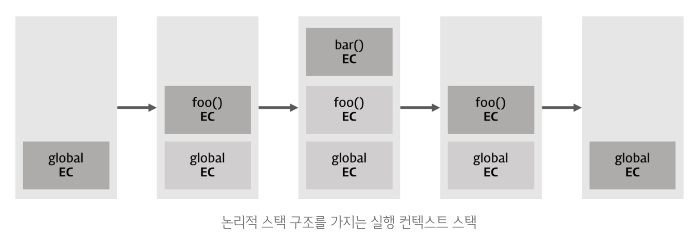

## 21장. 빌트인 객체
### 21.1 자바스크립트 객체의 분류
* 표준 빌트인 객체
  * ECMAScript 사양에 정의된 객체
  * 전역 객체의 프로퍼티로 제공
  * 애플리케이션 전역에서 사용 가능
  * Object, String, Number, Boolean, Symbol, Array, Map/Set, WeakMap/WeakSet, Function, Promise, RegExp, Date, Math, JSON, Error, Proxy, Reflect 등
* 호스트 객체
  * 호스트 환경(브라우저, Node.js)에서 제공하는 객체
  * DOM, BOM, Web Worker, Node.js의 API
* 사용자 정의 객체
  * 사용자가 직접 정의한 객체

### 21.2 표준 빌트인 객체
- Math, Reflect, JSON을 제외한 표준 빌트인 객체는 모두 생성자 함수 객체다.
- 생성자 함수인 표준 빌트인 객체가 생성한 인스턴스의 프로토타입은 표준 빌트인 객체의 prototype 프로퍼티에 바인딩된 객체다.
- 그리고 표준 빌트인 객체는 인스턴스 없이도 호출 가능한 정적 메서드를 제공한다.

### 21.3 원시값과 래퍼 객체
```javascript
const str = 'hi';

// 원시 타입인 문자열이 프로퍼티와 메서드를 갖는 객체처럼 동작한다.
console.log(str.length); // 2
console.log(str.toUpperCase()); // HI
```
- 원시값인 문자열, 숫자, 불리언 값의 경우 마침표 표기법(또는 대괄호 표기법)으로 접근하면 자바스크립트 엔진이 일시적으로 원시값을 연관된 객체로 변환해준다.
- 이렇게 생성된 객체를 래퍼 객체(wrapper object)라 한다.
- 래퍼 객체는 일시적이며, 원시값을 감싸는 래퍼 객체는 객체로서의 동작이 끝나면 사라진다.
```javascript
const str = 'hi';

// 식별자 str은 암묵적으로 생성된 래퍼 객체를 가리킨다.
// 식별자 str의 값 'hi'는 래퍼 객체의 [[StringData]] 내부 슬롯에 할당된다.
// 래퍼 객체에 name 프로퍼티가 동적 추가된다.
str.name = 'Lee';

// 식별자 str은 다시 원래의 문자열, 즉 래퍼 객체의 [[StringData]] 내부 슬롯에 할당된 원시값을 갖는다.
// 이때 래퍼 객체는 가비지 컬렉션의 대상이 된다.

// 식별자 str은 새롭게 암묵적으로 생성된(이전에 생성되었던 것과는 다른) 래퍼 객체를 가리킨다.
// 새롭게 생성된 래퍼 객체에는 name 프로퍼티가 존재하지 않는다.
console.log(str.name); // undefined
```

### 21.4 전역 객체
- 전역 객체는 코드가 실행되기 이전 단계에 자바스크립트 엔진에 의해 어떤 객체보다도 먼저 생성되는 특수한 객체다.
- 전역 객체는 자바스크립트 환경에 따라 다르게 부르는 이름이 다르다.
  * 브라우저 환경: window
  * Node.js 환경: global
* globalThis
  * ES11에서 도입된 표준 전역 객체
  * 브라우저 환경, Node.js 환경, 웹 워커 등 모든 환경에서 전역 객체를 가리키는 표준 방법
  * 브라우저 환경에서는 window, Node.js 환경에서는 global을 가리킨다.
- 전역 객체는 표준 빌트인 객체와 환경에 따른 호스트 객체(클라이언트 Web API 등)를 프로퍼티로 갖는다.
- 전역 객체의 특징
  - 전역 객체는 개발자가 의도적으로 생성할 수 없다.
  - 전역 객체의 프로퍼티를 참조할 때 window를 생략할 수 있다.
- var 키워드로 선언한 전역 변수와 선언하지 않은 변수에 값을 할당한 암묵적 전역, 그리고 전역 함수는 전역 객체의 프로퍼티가 된다.
- let, const 키워드로 선언한 전역 변수는 전역 객체의 프로퍼티가 아니다.

#### 21.4.1 빌트인 전역 프로퍼티
- 빌트인 전역 프로퍼티는 전역 객체의 프로퍼티로서 어디서든 참조할 수 있다.
- Infinity, NaN, undefined, globalThis, global 등

#### 21.4.2 빌트인 전역 함수
- 빌트인 전역 함수는 전역 객체의 메서드로서 어디서든 호출할 수 있다.
1. eval
    - 전달받은 문자열 코드를 런타임에 평가하여 값을 생성하고, 전달받은 인수가 표현식이 아닌 문이라면 문자열 코드를 런타임에 실행한다.
    - 문자열 코드가 여러개의 문으로 이루어져 있다면 모든 문을 실행한다.
```javascript
// 표현식인 문
eval('1 + 2'); // 3
// 표현식이 아닌 문 
eval('var x = 5'); // undefined

// eval 함수에 의해 런타임에 변수 선언문이 실행되어 x 변수가 선언되었다.
console.log(x); // 5
```
- eval 함수는 자신이 호출된 위치에 해당하는 기존의 스코프를 런타임에 동적으로 수정한다.
```javascript
const x = 1;

function foo(){
    // eval 함수는 런타임에 기존의 스코프를 동적으로 수정한다.
  eval('var x = 2');
  console.log(x); // 2
}

foo();
console.log(x); // 1
```
- 함수가 호출되면 런타임 이전에 먼저 함수 몸체 내부의 모든 선언문을 먼저 실행하고 그 결과를 스코프에 등록한다.
- 따라서 위 예제의 eval 함수가 호출되는 시점에는 이미 foo 함수의 스코프가 존재한다.
- 하지만 eval 함수는 런타임에 기존의 스코프를 동적으로 수정한다.
- 단 strict mode에서 eval 함수는 기존의 스코프를 수정하지 않고 eval 함수 자체의 스코프를 생성한다.
```javascript
const x = 1;

function foo(){
  'use strict';

  // strict mode에서 eval 함수는 기존의 스코프를 수정하지 않고 eval 함수 자체의 스코프를 생성한다.
  eval('var x = 2; console.log(x);'); // 2
  console.log(x); // 1
}

foo();
console.log(x); // 1
```
- 인수로 전달받은 문자열 코드가 let, const 키워드를 사용한 변수 선언문이라면 암묵적으로 strict mode가 적용된다.
- eval 함수를 통해 사용자로부터 입력받은 콘텐츠를 실행하는 것은 보안에 매우 취약하다.
- 또한 자바스크립트 엔진에 의해 최적화가 수행되지 않으므로 성능에도 악영향을 미친다.

2. isFinite
    - 전달받은 인수가 유한수인지 검사하여 결과를 불리언 값으로 반환한다.
    - 인수가 유한수면 true, 아니면 false를 반환한다.
```javascript
console.log(isFinite(0)); // true
console.log(isFinite(2e64)); // true
consolejson.log(isFinite('10')); // true
console.log(isFinite(null)); // true -> null은 0으로 강제 변환된다.
console.log(isFinite('Hello')); // false
console.log(isFinite('2005/12/12')); // false
```

3. isNaN
    - 전달받은 인수가 NaN인지 검사하여 결과를 불리언 값으로 반환한다.
    - 인수가 NaN이면 true, 아니면 false를 반환한다.
```javascript
console.log(isNaN(NaN)); // true
console.log(isNaN(10)); // false
console.log(isNaN('10')); // false -> '10'을 숫자로 암묵적 타입 변환한다.
console.log(isNaN('blue')); // true -> 'blue'를 숫자로 암묵적 타입 변환하면 NaN이다.
console.log(isNaN(true)); // false -> true를 숫자로 암묵적 타입 변환하면 1이다.
```

4. parseFloat
    - 전달받은 문자열 인수를 부동 소수점 숫자로 해석하여 반환한다.
    - 문자열 인수의 시작부터 숫자로 된 문자열을 파싱하여 숫자로 반환한다.
    - 문자열 인수가 부동 소수점 숫자가 아니라면 NaN을 반환한다.
```javascript
console.log(parseFloat('3.14')); // 3.14
console.log(parseFloat('10.00')); // 10
```

5. parseInt
    - 전달받은 문자열 인수를 정수로 해석하여 반환한다.
    - 문자열 인수의 시작부터 정수로 된 문자열을 파싱하여 정수로 반환한다.
    - 문자열 인수가 정수가 아니라면 NaN을 반환한다.
```javascript
console.log(parseInt('10')); // 10
console.log(parseInt('10', 2)); // 2 -> 2진수로 해석
```

6. encodeURI/ decodeURI
   - 완전한 URI를 문자열로 전달받아 이스케이프 처리를 위해 인코딩하거나 디코딩한다.
   - URI의 하위 개념으로 URL, URN이 있다.
   - http://example.com?name=dory&job=programmer
        - URL: http://example.com
        - URN: name=dory&job=programmer
   - 이스케이프 처리는 네트워크를 통해 정보를 공유할 때 어떤 시스템에서도 읽을 수 있는 아스키 문자로 변환하는 것을 말한다.

7. encodeURIComponent/ decodeURIComponent
    - URI 구성 요소를 인수로 전달받아 인코딩/디코딩 한다.
    - encodeURI/decodeURI는 완전한 URI를 인코딩/디코딩하는 반면, encodeURIComponent/decodeURIComponent는 URI 구성 요소를 인코딩/디코딩한다.

#### 21.4.3 암묵적 전역
- 암묵적 선언된 값은 변수 선언 없이 전역 객체의 프로퍼티로 추가되었으므로 변수가 아니다. 따라서 변수 호이스팅이 발생하지 않는다.
- 또한 변수가 아니기 때문에 delete 연산자로 삭제할 수 있다. 전역 변수는 프로퍼티이지만 delete 연산자로 삭제할 수 없다.

## 22장. this
- this 키워드는 자신이 속한 객체 또는 자신이 생성할 인스턴스를 가리키는 자기 참조 변수(self-referencing variable)다.
- this는 함수 호출 방식에 의해 동적으로 결정된다.

### 22.2 함수 호출 방식과 this 바인딩
- this 바인딩은 함수 호출 방식에 의해 동적으로 결정된다.
#### 22.2.1 일반 함수 호출
- 기본적으로 this에는 전역 객체가 바인딩된다.
- 일반 함수로 호출된 모든 함수(중첩 함수, 콜백 함수 포함) 내부의 this에는 전역 객체가 바인딩된다.
  - 하지만 중첩 함수나 콜백 함수 같은 헬퍼 함수의 경우 this가 일치하지 않는다는 것은 문제가 될 수 있다.
    - 이를 해결하기 위해 this를 일치시키는 방법으로 크게 세가지가 있다.
      1. 변수 that을 사용하는 방법
        ```javascript
        var value = 1;

        const obj = {
          value: 100,
          foo() {
          const that = this; 
   
          setTimeout(function () {
              console.log(that.value); // 100
          }, 100);
          },
          };
        ```
      2. Function.prototype.apply, Function.prototype.call, Function.prototype.bind 메서드를 사용하는 방법
        ```javascript
        var value = 1;

        const obj = {
          value: 100,
          foo() {
            setTimeout(function () {
              console.log(this.value); // 100
            }.bind(this), 100);
          },
        };
        ```
      3. 화살표 함수를 사용하는 방법도 있다.
         ```javascript
            var value = 1;

            const obj = {
            value: 100,
            foo() {
            // 화살표 함수 내부의 this는 상위 스코프의 this를 가리킨다.
            setTimeout(() => {
                console.log(this.value); // 100
                }, 100);
            },
            };
            ```


#### 22.2.2 메소드 호출
- 메소드 내부의 this에는 메소드를 호출한 객체, 즉 메서드를 호출할 때 메서드 이름 앞의 마침표 앞에 기술한 객체가 바인딩된다.
- 예를 들어 아래와 같이 getName 메서드는 다른 객체의 프로퍼티에 할당하는 것이므로 또 다른 객체의 메서드가 될 수도 있고 일반 변수에 할당하여 일반함수로 호출될 수도 있다.
```javascript
const person = {
  name: 'Lee',
  getName() {
    return this.name;
  },
};

const anotherPerson = {
  name: 'Kim',
};

anotherPerson.getName = person.getName;

console.log(anotherPerson.getName()); // Kim

const getName = person.getName;

console.log(getName()); // undefined (NodeJS), '' (브라우저)

```
- 프로토타입 메서드 내부에서 사용된 this도 일반 메서드와 마찬가지로 해당 메서드를 호출한 객체에 바인딩된다.
```javascript
function Person(name) {
  this.name = name;
}

Person.prototype.getName = function () {
  return this.name;
};

const me = new Person('Lee');

// getName 메서드를 호출한 객체는 me다.
console.log(me.getName()); // Lee

Person.prototype.name = 'Kim';

// getName 메서드를 호출한 객체는 Person.prototype이다.
console.log(Person.prototype.getName()); // Kim
```

#### 22.2.3 생성자 함수 호출
- 생성자 함수 내부의 this에는 생성자 함수가 생성할 인스턴스가 바인딩된다.
```javascript
function Circle(radius) {
  // 생성자 함수 내부의 this는 생성자 함수가 생성할 인스턴스를 가리킨다.
  this.radius = radius;
  this.getDiameter = function () {
    return 2 * this.radius;
  };
}

const circle1 = new Circle(5);

console.log(circle1.getDiameter()); // 10

const circle2 = new Circle(10);

console.log(circle2.getDiameter()); // 20
```

#### 22.2.4 Function.prototype.apply/call/bind 메서드에 의한 간접 호출
- apply, call, bind 메서드는 Function.prototype의 메서드이므로 모든 함수가 상속받아 사용할 수 있다.
- apply, call 메서드는 this로 사용할 객체와 인수 리스트를 인수로 전달받아 함수를 호출한다.
```javascript
function getThisBinding() {
  return this;
}

// this로 사용할 객체
const thisArg = { a: 1 };

console.log(getThisBinding()); // window

console.log(getThisBinding.apply(thisArg)); // { a: 1 }
console.log(getThisBinding.call(thisArg)); // { a: 1 }
```
- apply와 call 메서드의 본질적인 기능은 함수를 호출하는 것이다. 둘은 호출한 함수에 인수를 전달하는 방식만 다를 뿐 동일하게 동작한다.
```javascript
function add(a, b) {
  return a + b;
}

// apply 메서드는 인수를 배열로 전달한다.
console.log(add.apply(null, [1, 2])); // 3

// call 메서드는 인수를 쉼표로 구분한 리스트 형식으로 전달한다.
console.log(add.call(null, 1, 2)); // 3
```
- apply와 call 메서드의 대표적인 용도는 arguments 객체와 같은 유사 배열 객체에 배열 메서드를 사용하는 것이다.
```javascript
function convertArgsToArray() {
  console.log(arguments);

  // arguments 객체를 배열로 변환
  // Array.prototype.slice를 인수 없이 호출하면 배열의 복사본을 생성한다.
  const arr = Array.prototype.slice.call(arguments);
  console.log(arr);

  return arr;
}

convertArgsToArray(1,2,3); // [1,2,3]
```

- bind 메서드는 apply, call 메서드와 달리 함수를 호출하지는 않고 this로 사용할 객체만 전달한다.
```javascript
function getThisBinding() {
  return this;
}

// this로 사용할 객체
const thisArg = { a: 1 };

// bind 메서드는 첫번째 인수로 전달한 thisArg로 this 바인딩이 교체된 함수를 반환한다. 
const boundFunc = getThisBinding.bind(thisArg); // getThisBinding
// bind 메서드는 함수를 호출하지는 않으므로 명시적으로 호출해야 한다.
console.log(getThisBinding.bind(thisArg)()); // { a: 1 }
```

- bind 메서드는 This와 메서드 내부의 중첩 함수 또는 콜백 함수의 this가 불일치하는 문제를 해결하기 위해 유용하게 사용된다.
```javascript
const person = {
    name: 'Lee',
    foo(callback) {
        setTimeout(callback, 100);
    }
}

person.foo(function(){
    console.log(`Hi! my name is ${this.name}`);
    // 일반 함수로 호출된 콜백 함수 내부의 this.name은 브라우저 환경에서 window.name을 가리킨다.
    // Node.js 환경에서는 undefined이다.
})
```
- bind 메서드를 사용하면 this가 일치하게 할 수 있다.
```javascript
const person = {
    name: 'Lee',
    foo(callback) {
        // bind 메서드로 callback 함수 내부의 this 바인딩을 전달한다.
        setTimeout(callback.bind(this), 100);
    }
}

person.foo(function(){
    console.log(`Hi! my name is ${this.name}`);
})
```

## 23장. 실행 컨텍스트
### 23.1 소스코드의 타입
- ECMAScript 사양은 소스코드(ECMAScript code)를 4가지 타입으로 구분한다. 4가지 타입의 소스코드는 실행 컨텍스트를 생성한다.

| 소스코드 타입 | 설명 |
| --- | --- |
| 전역 코드 | 전역에 존재하는 소스코드. 전역에 정의된 함수. 클래스 등의 내부 코드는 포함되지 않는다. |
| 함수 코드 | 함수 내부에 존재하는 소스코드. 함수 내부에 중첩된 함수, 클래스 등의 내부 코드는 포함되지 않는다. |
| eval 코드 | 빌트인 전역 함수인 eval 함수에 의해 실행되는 소스코드. |
| 모듈 코드 | 모듈 내부에 존재하는 소스코드. 모듈 내부의 함수, 클래스 등의 내부 코드는 포함되지 않는다. |

1. 전역 코드
- 전역 코드는 전역 변수를 관리하기 위해 최상위 스코프인 전역 스코프를 생성해야 한다.
- 그리고 var 키워드로 선언된 전역 변수와 함수 선언문으로 정의된 전역 함수를 전역 객체의 프로퍼티와 메서드로 바인딩하고 참조하기 위해 전역 객체와 연결되어야 한다. 
- 이를 위해 전역 코드가 평가되면 전역 실행 컨텍스트가 생성된다.

2. 함수 코드
- 함수 코드는 지역 스코프를 생성하고 지역 변수, 매개변수, arguments 객체를 관리해야 한다.
- 그리고 생성한 지역 스코프를 전역 스코프에서 시작하는 스코프 체인의 일원으로 연결해야 한다.
- 이를 위해 함수 코드가 평가되면 함수 실행 컨텍스트가 생성된다.
3. eval 코드
- eval 코드는 strict mode에서 자신만의 독자적인 스코프를 생성한다.
- 이를 위해 eval 코드가 평가되면 eval 실행 컨텍스트가 생성된다.
4. 모듈 코드
- 모듈 코드는 모듈별로 독자적인 모듈 스코프를 생성한다.
- 이를 위해 모듈 코드가 평가되면 모듈 실행 컨텍스트가 생성된다.

### 23.2 소스코드의 평가와 실행
- 자바스크립트 엔진은 소스코드를 2개의 과정, 즉 평가와 실행으로 나누어 처리한다.
- 소스코드 평가 과정에서는 실행 컨텍스트를 생성하고 변수, 함수 등의 선언문만 먼저 실행하여 생성된 변수나 함수 식별자를 키로 실행 컨텍스트가 관리하는 스코프(렉시컬 환경의 환경 레코드)에 등록한다.
- 소스코드 평가 과정이 끝나면 비로소 선언문을 제외한 소스코드가 순차적으로 실행되기 시작한다.  즉, 런타임이 시작된다.
- 이때 소스코드 실행에 필요한 정보, 즉 변수나 함수의 참조를 실행 컨텍스트가 관리하는 스코프에서 검색하여 취득한다.
- 그리고 변수 값의 변경 등 소스코드의 실행 결과는 다시 실행 컨텍스트가 관리하는 스코프에 등록된다.

### 23.3 실행 컨텍스트의 역할
```javascript
// 전역 변수 선언
const x = 1;
const y = 2;

// 함수 정의
function foo(a) {
    // 지역 변수 선언
    const x = 10;
    const y = 10;
    
    // 메서드 호출
    console.log(a + x + y);
}

// 함수 호출
foo(100);

// 메서드 호출
console.log(x + y); //3
```
1. 전역 코드 평가
- 전역 코드를 실행하기에 앞서 전역 코드 평가 과정을 거치며 전역 코드를 실행하기 위한 준비를 한다.
- 소스코드 평가 과정에서는 선언문만 먼저 실행한다.
- 따라서 전역 코드의 변수 선언문과 함수 선언문이 먼저 실행되고 생성된 변수나 함수 식별자를 실행 컨텍스트가 관리하는 스코프에 등록한다.
- 이때 전역 코드의 변수 선언문은 전역 객체의 프로퍼티가 되고 함수 선언문은 전역 객체의 메서드가 된다.
2. 전역 코드 실행
- 전역 코드 평가 과정이 끝나면 런타임이 시작되어 전역 코드가 순차적으로 실행된다.
- 이때 전역 변수에 값이 할당되고 함수가 호출된다.
- 함수가 호출되면 순차적으로 실행되던 전역 코드의 실행을 일시 중단하고 함수 코드 평가 과정이 시작된다.
3. 함수 코드 평가
- 함수 코드 평가 과정에서는 함수 코드를 실행하기 위한 준비를 한다.
- 이때 매개변수와 지역 변수 선언문이 먼저 실행되고, 생성된 변수나 함수 식별자를 실행 컨텍스트가 관리하는 지역 스코프에 등록한다.
- 또한 함수 내부에서 지역 변수처럼 사용할 수 있는 arguments 객체가 생성되고 this 바인딩이 결정된다.
4. 함수 코드 실행
- 함수 코드 평가 과정이 끝나면 런타임이 시작되어 함수 코드가 순차적으로 실행된다.
- 이때 함수 코드에서 변수에 값이 할당되고 메서드가 호출된다.

- 코드가 실행되려면 다음과 같이 스코프, 식별자, 코드 실행 순서 등의 관리가 필요하다.
1. 선언에 의해 생성된 모든 식별자(변수, 함수, 클래스 등)를 스코프를 구분하여 등록하고 상태 변화(식별자에 바인딩된 값의 변화)를 지속적으로 관리할 수 있어야 한다.
2. 스코프는 중첩 관계에 의해 스코프 체인을 형성해야 한다. 즉, 스코프 체인을 통해 상위 스코프로 이동하며 식별자를 검색할 수 있어야 한다.
3. 현재 실행 중인 코드의 실행 순서를 변경(예를 들어, 함수 호출에 의한 실행 순서 변경)할 수 있어야 하며 다시 되돌아갈 수도 있어야 한다.
- 실행 컨텍스트는 소스코드를 실행하는 데 필요한 환경을 제공하고 코드의 실행 결과를 실제로 관리하는 영역이다.
- 식별자와 스코프는 실행 컨텍스트의 렉시컬 환경으로 관리하고 코드 실행 순서는 실행 컨텍스트 스택으로 관리한다.

### 23.4 실행 컨텍스트 스택
- 실행 컨텍스트는 스택 자료 구조로 관리된다.
```javascript
const x = 1;

function foo() {
  const y = 2;

  function bar() {
    const z = 3;
    console.log(x + y + z);
  }

  bar();
}

foo(); // 6
```

1. 전역 코드의 평가와 실행
- 전역 변수 x와 전역 함수 foo는 전역 실행 컨텍스트에 등록된다.
- 이후 전역 코드가 실행되기 시작하여 전역 변수 x에 값이 할당되고 전역 함수 foo가 호출된다.
2. foo 함수 코드의 평가와 실행
- foo 함수의 지역 변수 y와 중첩 함수 bar가 foo 함수 실행 컨텍스트에 등록된다.
- 이후 foo 함수 코드가 실행되기 시작하여 foo 함수의 지역 변수 y에 값이 할당되고 중첩 함수 bar가 호출된다.
3. bar 함수 코드의 평가와 실행
- bar 함수의 지역 변수 z가 bar 함수 실행 컨텍스트에 등록된다.
- 이후 bar 함수 코드가 실행되기 시작하여 bar 함수의 지역 변수 z에 값이 할당되고 console.log(x + y + z)가 실행된다.
  - 이 때 console.log도 실행 컨텍스트를 생성하고 스택에 푸시되지만 그림에서 생략되었다.
4. foo 함수 코드로 복귀
- bar 함수의 실행이 종료되면 bar 함수 실행 컨텍스트는 스택에서 팝되어 제거된다.
5. 전역 코드로 복귀
- foo 함수의 실행이 종료되면 foo 함수 실행 컨텍스트는 스택에서 팝되어 제거된다.

- 실행 컨텍스트 스택은 코드의 실행 순서를 관리한다.
- 실행 컨텍스트 스택의 최상위에 존재하는 실행 컨텍스트(running execution context)가 현재 실행 중인 코드의 실행 컨텍스트다.

### 23.5 렉시컬 환경
- 렉시컬 환경은 식별자와 식별자에 바인딩된 값, 그리고 상위 스코프에 대한 참조를 기록하는 자료구조로 실행 컨텍스트를 구성하는 컴포넌트다.
- 실행 컨텍스트 스택이 코드의 실행 순서를 관리한다면 렉시컬 환경은 스코프와 식별자를 관리한다.
- 실행 컨텍스트는 LexicalEnvironment 프로퍼티와 VariableEnvironment 프로퍼티를 갖는다.
- 생성 초기에 두 프로퍼티는 동일한 렉시컬 환경을 가리키지만 이후 몇 가지 상황을 만나면 두 컴포넌트는 내용이 달라지는 경우도 있다.
- 렉시컬 환경은 다음과 같이 두 개의 컴포넌트로 구성된다.
1. 환경 레코드(Environment Record)
- 스코프에 포함된 식별자를 등록하고 등록된 식별자에 바인딩된 값을 관리하는 저장소
2. 외부 렉시컬 환경에 대한 참조(outer lexical environment reference)
- 상위 스코프를 가리키는 참조
- 이때 상위 스코프란 외부 렉시컬 환경, 즉 해당 실행 컨텍스트를 생성한 소스코드를 포함하는 상위 코드의 렉시컬 환경을 말한다.

### 23.6 실행 컨텍스트의 생성과 식별자 검색 과정
해당 예제를 통해 어떻게 실행 컨텍스트가 생성되고 코드 실행 결과가 관리되는지 살펴보자.
```javascript
var x = 1;
const y = 2;

function foo(a) {
  var x = 3;
  const y = 4;

  function bar(b) {
    const z = 5;
    console.log(a + b + x + y + z);
  }

  bar(10);
}

foo(20); // 42
```

#### 23.6.1 전역 객체 생성
- 전역 객체는 전역 코드가 평가되기 이전에 생성된다.
- 이때 빌트인 전역 프로퍼티와 빌트인 전역 함수, 그리고 표준 빌트인 객체가 추가되며 동작 환경에 따라 클라이언트 또는 특정 환경을 위한 호스트 객체를 포함한다.
- 전역 객체도 Object.prototype을 상속받는다.

#### 23.6.2 전역 코드 평가
- 전역 코드 평가는 다음과 같은 순서로 진행된다.
1. 전역 실행 컨텍스트 생성
2. 전역 렉시컬 환경 생성
   - 전역 환경 레코드 생성
     - 객체 환경 레코드 생성
     - 선언적 환경 레코드 생성
   - this 바인딩
   - 외부 렉시컬 환경에 대한 참조 결정

- 세부적인 생성 과정
1. 전역 실행 컨텍스트 생성
- 먼저 전역 실행 컨텍스트를 생성하여 실행 컨텍스트 스택에 푸시
2. 전역 렉시컬 환경 생성
   - 전역 렉시컬 환경을 생성하고 전역 실행 컨텍스트에 바인딩한다.
   - 이때 전역 렉시컬 환경은 전역 환경 레코드와 외부 렉시컬 환경에 대한 참조로 구성된다.
   - 세부 순서
     1. 전역 환경 레코드 생성
        - 기존의 var 키워드로 선언한 전역 변수와 let, const 키워드로 선언한 전역 변수를 관리하기 위해 객체 환경 레코드와 선언적 환경 레코드를 생성한다.
        - 객체 환경 레코드: 기존의 전역 객체가 관리하던 var 키워드로 선언한 전역 변수, 함수 선언문으로 정의한 전역 함수, 빌트인 전역 프로퍼티와 빌트인 전역 함수, 표준 빌트인 객체 관리
        - 선언적 환경 레코드: let, const 키워드로 선언한 전역 변수를 관리
     2. 객체 환경 레코드 생성
        - 객체 환경 레코드는 BindingObject라고 부르는 객체와 연결된다.
        - 전역 코드 평가 과정에서 var 키워드로 선언한 전역 변수와 함수 선언문으로 정의한 전역 함수, 빌트인 전역 프로퍼티와 빌트인 전역 함수, 표준 빌트인 객체가 BindingObject에 바인딩된다.
     3. 선언적 환경 레코드 생성
     4. this 바인딩
        - 전역 환경 레코드의 [[GlobalThisValue]] 내부 슬롯에 this가 바인딩 된다.
        - this 바인딩은 전역 환경 레코드와 함수 환경 레코드에만 존재한다.
     5. 외부 렉시컬 환경에 대한 참조 결정
        - 현재 평가 중인 소스코드를 포함하는 외부 소스코드와 렉시컬 환경, 즉 상위 스코프를 가리킨다.
        - 이를 통해 단방향 링크드 리스트인 스코프 체인을 구현한다.
        - 전역 렉시컬 환경의 외부 렉시컬 환경에 대한 참조는 null이다.
   - 세부 구조
     - 전역 환경 레코드
       - 객체 환경 레코드
       - 선언적 환경 레코드
       - this 바인딩

#### 23.6.3 전역 코드 실행
- 변수 할당문 또는 함수 호출문을 실행하려면 먼저 변수나 함수 식별자를 검색해야 한다.
- 이때 변수나 함수 식별자를 검색하기 위해 렉시컬 환경을 참조한다.
- 식별자 결정을 위해 실행 중인 실행 컨텍스트에서 식별자를 검색하기 시작한다.
- 만약 식별자를 검색하는 데 실패하면 외부 렉시컬 환경에 대한 참조를 따라 상위 스코프로 이동하여 식별자를 검색한다.

#### 23.6.4 foo 함수 코드 평가
- foo 함수가 호출되면 전역 코드의 실행을 일시 중단하고 foo 함수 내부로 코드의 제어권이 이동한다.
- 함수 코드 평가는 아래 순서로 진행된다.
  1. foo 함수 실행 컨텍스트 생성
  2. 함수 렉시컬 환경 생성
     - 함수 환경 레코드 생성
       - 함수 환경 레코드는 매개변수 arguments 객체, 함수 내부에서 선언한 지역 변수와 중첩 함수를 등록하고 관리한다.
     - this 바인딩
       - 함수 환경 레코드의 [[ThisValue]] 내부 슬롯에 this가 바인딩된다.
       - 내부 슬롯에 바인딩될 객체는 함수 호출방식에 따라 결정된다.
       - foo 함수는 일반 함수로 호출되었으므로 this는 전역 객체를 가리킨다.
     - 외부 렉시컬 환경에 대한 참조 결정
       - foo 함수의 외부 렉시컬 환경에 대한 참조는 전역 렉시컬 환경을 가리킨다.
       - 자바스크립트는 함수를 어디에서 호출했는지가 아니라 어디에 정의했는지에 따라 상위 스코프를 결정한다.
       - 자바스크립트 엔진은 함수 객체를 생성할 때 현재 실행 중인 실행 컨텍스트의 렉시컬 환경, 즉 함수의 상위 스코프를 함수 객체의 내부 슬롯 [[Environment]]에 저장한다.
       - 함수 렉시컬 환경의 외부 렉시컬 환경에 대한 참조에 할당되는 것은 바로 함수의 상위 스코프를 가리키는 함수 객체의 내부 슬롯 [[Environment]]에 저장된 렉시컬 환경의 참조다.

#### 23.6.5 foo 함수 코드 실행
- 이제 런타임이 시작되어 foo 함수의 소스코드가 순차적으로 실행되기 시작한다.
- 매개 변수에 인수가 할당되고, 지역 변수에 값이 할당되며 중첩 함수가 호출된다.
- 중첩 함수 bar가 호출되면 식별자 결정을 위해 실행 중인 실행 컨텍스트의 렉시컬 환경에서 식별자를 검색하기 시작한다.
- 만약 식별자를 검색하는 데 실패하면 외부 렉시컬 환경에 대한 참조를 따라 상위 스코프로 이동하여 식별자를 검색한다.

#### 23.6.6 bar 함수 코드 평가
#### 23.6.7 bar 함수 코드 실행
- bar 함수 코드 평가와 실행은 foo 함수 코드 평가와 실행과 동일한 과정을 거친다.
  1. console 식별자 검색
     - 먼저 console 식별자를 스코프 체인에서 검색한다.
     - console 식별자는 전역 렉시컬 환경의 객체 환경 레코드의 BindingObject를 통해 전역 객체에서 찾을 수 있다.
  2. log 메서드 검색
     - console 객체의 프로퍼티인 log 메서드를 검색한다. 이때 console 객체의 프로토타입 체인을 통해 메서드를 검색한다.
     - log 메서드는 상속된 프로퍼티가 아니라 console 객체의 메서드이므로 console 객체의 프로퍼티로 바인딩되어 있다.
  3. 표현식 a+b+x+y+z의 평가
  4. console.log 메서드 호출

#### 23.6.8 bar 함수 코드 실행 종료
- bar 함수 코드 실행이 종료되면 bar 함수 실행 컨텍스트는 실행 컨텍스트 스택에서 팝되어 제거된다.
- 실행 컨텍스트 스택에서 bar 함수 실행 컨텍스트가 제거되었다고 해서 bar 함수 렉시컬 환경까지 즉시 소멸되는 것은 아니다.
- 객체를 포함한 모든 값은 누군가에 의해 참조되지 않을 때 비로소 가비지 컬렉터에 의해 메모리 공간의 확보가 해제되어 소멸한다.

#### 23.6.9 foo 함수 코드 실행 종료
#### 23.6.10 전역 코드 실행 종료

### 23.7 실행 컨텍스트와 블록 스코프
- let, const 키워드로 선언한 변수는 모든 코드블록을 지역 스코프로 인정하는 블록 레벨 스코프를 가진다.
```javascript
let x = 1;

if (true) {
    let x = 10;
    console.log(x); // 10
}

console.log(x); // 1
```

- if 문의 코드 블록이 실행되면 if 문의 코드 블록을 지역 스코프로 인정하는 블록 레벨 스코프를 생성한다.
- 이를 위해 선언적 환경 레코드를 갖는 렉시컬 환경을 새롭게 생성하여 기존의 전역 렉시컬 환경을 교체한다.
- 이때 새롭게 생성된 if문의 코드 블록을 위한 렉시컬 환경의 외부 렉시컬 환경에 대한 참조는 if 문이 실행되기 이전의 전역 렉시컬 환경을 가리킨다.
- if 문 코드 블록의 실행이 종료되면 if 문의 코드 블록이 실행되기 이전의 렉시컬 환경으로 되돌린다.

## 24장. 클로저
- 클로저는 함수와 그 함수가 선언된 렉시컬 환경과의 조합이다.
```javascript
const x = 1;

function outerFunc() {
  const x = 10;
  function innerFunc() {
    console.log(x); // 10
  }
  innerFunc();
}

outerFunc();
```
- innerFunc 함수는 outerFunc 함수 내부에서 정의되었다. 이때 innerFunc 함수는 outerFunc 함수의 지역 변수 x에 접근할 수 있다.
- 이는 innerFunc 함수가 자신이 정의된 위치에 따라 상위 스코프를 결정하는 렉시컬 스코프를 갖기 때문이다.

### 24.1 렉시컬 스코프
- 자바스크립트 엔진은 함수를 어디서 호출했는지가 아니라 어디에 정의했는지에 따라 상위 스코프를 결정한다. 이를 렉시컬 스코프라 한다.

### 24.2 함수 객체의 내부 슬롯 [[Environment]]
- 함수는 자신의 내부 슬롯 [[Environment]]에 자신이 정의된 환경, 즉 상위 스코프의 렉시컬 환경에 대한 참조를 저장한다.

```javascript
const x = 1;

function foo(){
    const x = 10;
    
    // 상위 스코프는 함수 정의 환경(위치)에 따라 결정된다.
    // 함수 호출 위치와 상위 스코프는 아무런 관계가 없다.
    bar();
}

// 함수 bar는 자신의 상위 스코프, 즉 전역 렉시컬 환경을 [[Environment]]에 저장하여 기억한다.
function bar(){
    console.log(x);
}

foo()
bar()
```
### 24.3 클로저와 렉시컬 환경
```javascript
const x = 1;

function outer(){
    const x = 10;
    const inner = function(){
        console.log(x);
    }
    return inner;

}

// outer 함수를 호출하면 중첩 함수 inner를 반환한다.
// 이때 outer 함수의 실행 컨텍스트는 실행 컨텍스트 스택에서 팝되어 제거된다.
const innerFunc = outer();
innerFunc()
```
- 외부 함수보다 중첩 함수가 더 오래 유지되는 경우 중첩 함수는 이미 생명주기가 종료한 외부 함수의 변수를 참조할 수 있다. 이러한 중첩 함수를 클로저라고 부른다.
- outer 함수의 실행이 종료하면 inner 함수를 반환하면서 Outer 함수의 생명 주기가 종료된다. 하지만 outer 함수의 렉시컬 환경까지 소멸하는 것은 아니다.

```html
<!DOCTYPE html>
<html>
    <body>
        <script>
            function foo(){
                const x = 1;
                const y = 2;
                
                // 일반적으로 클로저라고 하지 않는다.
                function bar(){
                    const z = 3;
                    
                    debugger;
                    // 상위 스코프의 식별자를 참조하지 않는다.
                    console.log(z);
                }
                
                return bar;
            }
            
            const bar = foo();
            bar()
        </script>
    </body>
</html>
```

- 상위 스코프의 어떤 식별자도 참조하지 않는 경우 대부분의 모던 브라우저는 최적화를 통해 상위 스코프를 기억하지 않는다.
- 따라서 bar 함수는 클로저라고 할 수 없다.

```html
<!DOCTYPE html>
<html>
    <body>
        <script>
            function foo(){
                const x = 1;
                
                // bar 함수는 클로저였지만 곧바로 소멸한다.
                // 이러한 함수는 일반적으로 클로저라고 하지 않는다.
                function bar(){
                    debugger;
                    console.log(x);
                }
                bar();
            }
            foo()
        </script>
    </body>
</html>
```

- bar 함수는 상위 스코프의 식별자를 참조하고 있으므로 클로저다. 하지만 외부 함수 foo의 외부로 중첩 함수 bar가 반환되지 않는다.
- 이러한 함수는 일반적으로 클로저라고 하지 않는다.

```html
<!DOCTYPE html>
<html>
    <body>
        <script>
            function foo(){
                const x = 1;
                const y = 2.
                
                // 클로저
                // 중첩 함수 bar는 외부 함수보다 더 오래 유지되며 상위 스코프의 식별자를 참조한다.
                function bar(){
                    debugger;
                    console.log(x);
                }
                return bar;
            }
            const bar = foo();
            bar();
        </script>
    </body>
</html>
```

- 위처럼 클로저는 중첩 함수가 상위 스코프의 식별자를 참조하고 있고 중첩 함수가 외부 함수보다 더 오래 유지되는 경우에 한정하는 것이 일반적이다.
- 클로저에 참조되는 상위 스코프의 변수를 자유 변수라고 부른다.
- 클로저란 함수가 자유 변수에 대해 닫혀있다는 의미이며 자유 변수에 묶여있는 함수라고 할 수 있다.

### 24.4 클로저의 활용
- 클로저는 상태를 안전하게 변경하고 유지하기 위해 사용한다.
- 다시 말해, 상태가 의도치 않게 변경되지 않도록 상태를 안전하게 은닉하고 특정 함수에게만 상태 변경을 허용하기 위해 사용한다.
```javascript
// 카운트 상태 변수
let num = 0;

const increase = function(){
    return ++num;
}

console.log(increase()); // 1
console.log(increase()); // 2
console.log(increase()); // 3
```
- 위 코드는 잘 동작하지만 오류를 일으킬 가능성을 내포하고 있는 좋지 않은 코드다.
- 잘 동작하기 위해 전제 조건이 붙는다. 
  1. 카운트 상태(num 변수의 값)은 함수가 호출되기 전까지 변경되지 않고 유지되어야 한다.
  2. 이를 위해 카운트 상태(num 변수의 값)은 increate 함수만이 변경할 수 있어야 한다.

```javascript
const increase = (function(){
    // 카운트 상태 변수
    let num = 0;
    
    // 클로저
    // increase 함수는 자유 변수 num을 스코프 체인을 통해 참조할 수 있다.
    return function(){
        return ++num;
    }
}());

console.log(increase()); // 1
console.log(increase()); // 2
```

- 위 코드가 실행되면 즉시 실행 함수가 호출되고 즉시 실행 함수가 반환한 함수가 increase 변수에 할당된다.
- 이때 즉시 실행 함수가 반환한 클로저는 자신이 정의된 위치에 의해 결정된 상위 스코프인 즉시 실행 함수의 렉시컬 환경을 기억하고 있다.
- 이처럼 클로저는 상태가 의도치 않게 변경되지 않도록 안전하게 은닉하고 특정 함수에게만 상태 변경을 허용하여 상태를 안전하게 변경하고 유지하기 위해 사용한다.

```javascript
const counter = (function(){
    let num = 0;
    
    return {
        increase(){
            return ++num;
        },
        decrease(){
            return num > 0 ? --num : 0;
        }
        // 아래와 동일
        // increase: function() {}
        // decrease: function() {}
    }
}())

console.log(counter.increase()) //1
console.log(counter.increase()) //2

console.log(counter.decrease()) //1
console.log(counter.decrease()) //0
```

- 위 예제에서 즉시 실행 함수가 반환하는 객체 리터럴은 즉시 실행 함수의 실행 단계에서 평가되어 객체가 된다.
- 위 예제를 생성자 함수로 표현하면 다음과 같다.
```javascript
const Counter = (function(){

    let num = 0;
    function Counter(){
        // this.num= 0; 프로퍼티는 public하므로 은닉되지 않는다.
    }

    Counter.prototype.increase = function(){
        return ++num;
    }

    Counter.prototype.decrease = function(){
        return --num;
    }

    return Counter;
}())

const counter = new Counter();
console.log(counter.increase());
console.log(counter.increase());
```

- 다음은 함수형 프로그래밍에서 클로저를 활용하는 간단한 예제다.
```javascript
// 함수를 인수로 전달받고 함수를 반환하는 고차 함수
// 이 함수는 카운트 상태를 유지하기 위한 자유 변수 counter를 기억하는 클로저를 반환한다.
function makeCounter(aux){
    let counter = 0;
    return function(){
        counter = aux(counter);
        return counter;
    }
}
// 보조 함수
function increase(n){
    return ++n;
}

function decrease(n){
    return --n;
}

// 함수로 함수를 생성한다.
const increaseCounter = makeCounter(increase);
console.log(increaseCounter()); // 1
console.log(increaseCounter()); // 2

// increase 함수와는 별개의 독립된 카운터 상태를 유지한다.
const decreaseCounter = makeCounter(decrease);
console.log(decreaseCounter()); // -1
console.log(decreaseCounter()); // -2
```

### 24.5 캡슐화와 정보 은닉
- 캡슐화는 객체의 상태를 나타내는 프로퍼티와 프로퍼티를 참조하고 조작할 수 있는 동작인 메서드를 하나로 묶는 것을 말한다.
- 정보 은닉은 외부에 공개할 필요가 없는 구현의 일부를 외부로부터 감추어 정보를 보호하고 상태 변경을 제어하는 것을 말한다.
- 이를 통해 객체 간의 상호 의존성, 즉 결합도를 낮추는 효과가 있다.
- 자바스크립트는 public, private, protected 등의 접근 제한자를 제공하지 않는다.
- 따라서 객체의 모든 프로퍼티와 메서드는 기본적으로 public하다.

```javascript
const Person = (function () {
  let _age = 0;

  // 생성자 함수
  function Person(name, age) {
    this.name = name; // public
    _age = age;
  }

  // 프로토타입 메서드
  Person.prototype.sayHi = function () {
    console.log(`Hi! My name is ${this.name}. I am ${_age}.`);
  };

  // 생성자 함수를 반환
  return Person;
})();

const me = new Person("Lee", 20);
me.sayHi(); // Hi! My name is Lee. I am 20.
console.log(me.name); // Lee
console.log(me._age); // undefined
```
- 위 패턴을 사용하면 _age 변수는 Person 생성자 함수 내부에서만 접근할 수 있고 외부에서는 접근할 수 없다.
- 그리고 sayHi 메서드는 프로토타입 메서드이므로 인스턴스가 상속받아 사용할 수 있다. 즉, 중복 생성되지 않는다.
- 하지만 Person 생성자 함수가 여러 개의 인스턴스를 생성할 경우 _age 변수의 상태가 유지되지 않는다.
- sayHi 메서드가 즉시 실행 함수가 호출될 때 단 한번 생성되기 떄문이다.
- 이처럼 자바스크립트는 정보 은닉을 완전하게 지원하지 않는다.
- 이를 TC39 프로세스의 Stage 3에 클래스에 Private 필드를 정의할 수 있는 새로운 표준 사양이 제안되어 있다.

### 24.6 자주 발생하는 실수
```javascript
var funcs = [];

for (var i = 0; i < 3; i++) {
  funcs[i] = function () {
    console.log(i);
  };
}

for (var j = 0; j < 3; j++) {
  funcs[j](); // 3 3 3
}
```

- 위 코드는 0, 1, 2를 출력할 것으로 예상했지만 3, 3, 3을 출력한다.
- 이는 var 키워드로 선언한 변수 i는 전역 변수이기 때문이다.
- 따라서 함수가 호출되는 시점에는 이미 반복문이 종료되어 i의 값은 3이다.
```javascript
var funcs = [];

for (var i = 0; i < 3; i++) {
  funcs[i] = (function (id) {
    return function () {
      console.log(id);
    };
  })(i);
}

for (var j = 0; j < 3; j++) {
  funcs[j](); // 0 1 2
}
```

- 위 코드는 즉시 실행 함수를 활용하여 클로저를 생성하여 해결한다.
- 즉시 실행 함수는 반복문이 실행될 때마다 새로운 렉시컬 환경을 생성하고 반복문이 종료되면 렉시컬 환경이 소멸한다.
- 따라서 클로저가 기억하는 id 변수의 값은 반복문이 실행될 때마다 새롭게 할당된다.
- 이를 통해 클로저가 반복문이 종료된 이후에도 반복문이 실행될 때의 id 변수의 값을 기억할 수 있다.

- let 키워드를 사용하면 코드가 더 깔끔해질 수 있다.
```javascript
const funcs = [];

for (let i = 0; i < 3; i++) {
  funcs[i] = function () {
    console.log(i);
  };
}

for (let j = 0; j < 3; j++) {
  funcs[j](); // 0 1 2
}
```

## 느낀 점과 공유
유독 궁금했고 이해가 잘 되지 않았던 개념들에 대해 차근차근 공부하니 벅차지만 ㅎㅎ 재미있었습니다. 꾸준한 복습이 중요한 것 같습니다.

예시를 봐도 와닿지 않다가 react의 useState가 왜 클로저인지에 대해 잘 정리한 [블로그](https://seokzin.tistory.com/entry/React-useState%EC%9D%98-%EB%8F%99%EC%9E%91-%EC%9B%90%EB%A6%AC%EC%99%80-%ED%81%B4%EB%A1%9C%EC%A0%80)가 있어 함께 공유드립니다.

블로그 쓰신 분이 구현한것까지는 겨우겨우 알겠는데 React의 실제 코드를 보고,,, 왜 React 개발자들이 대단한지 다시금 생각하게 되었습니다,,,,